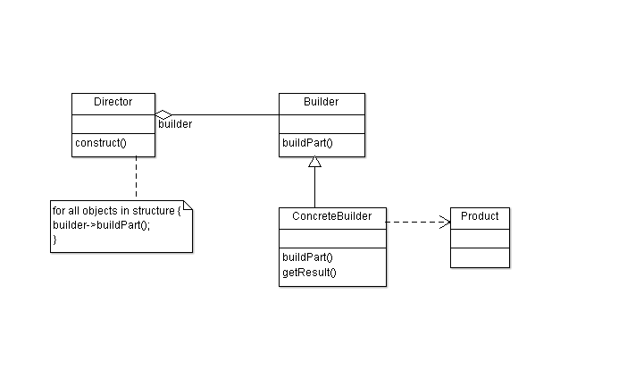
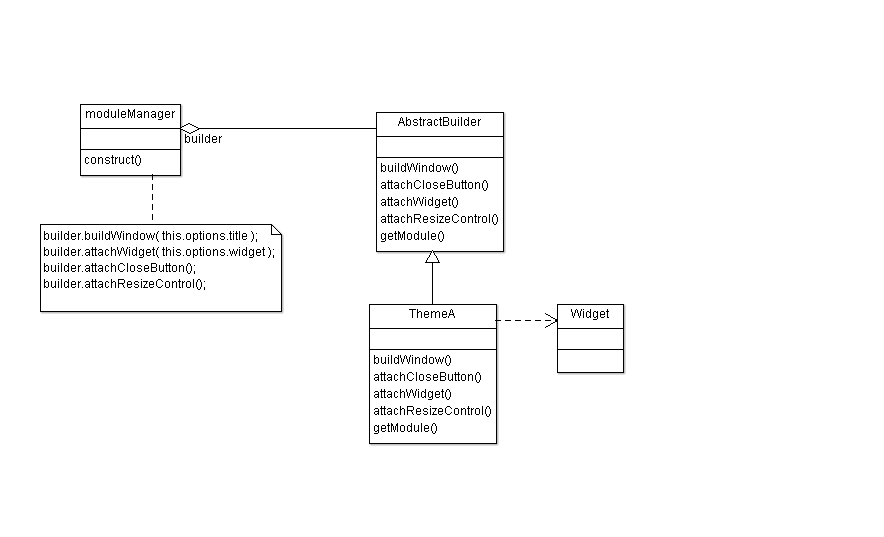
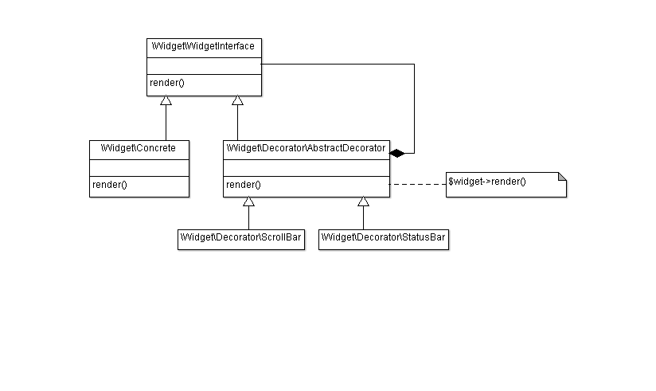
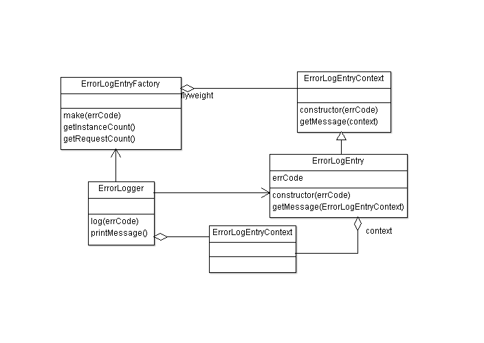

## &nbsp;
{: .bs-docs-section #welcome}
<article id="welcome" class="bs-docs-section-header" markdown="1">

# Design Patterns for Web-Developer

Online book by [Dmitry Sheiko](http::/dsheiko.com)
{: .lead}

</article>

## Preface
{: .bs-docs-section #preface}
I ran into software design pattern concept just few years after millenium. 
I took it serious much later, but that's now already years since I started to study and re-study the patterns.
From the pattern documentation that is a masterpiece by GoF and by Martin Fowler it always seems so
easy to grasp. However, one doesn't really get it until he has some experience implementing the patterns in
own tasks. So studying I make wed related examples

with every new read book or article I've been getting a better grasp on them.

Why This Handbook Was Written

I've been studying DP for years, but with every new read book I see far I was
on .. 
That's about web applicable examples
So this is an online book on github to be continously updated

## Introduction
{: .bs-docs-section #introduction}
After having your project fully tested, deployed and running, it seems the application architecture is pretty
good enough. All the requirements met and everybody is happy. But then as it happens,
the requirements change and you, all of sudden, find yourself in the time of troubles.
It comes out that some modules easier to hack than to modify. Change of other ones brings
endless changes in a cascade of dependent modules. Or you change one module and whole
the application starts to collapse like a house of cards. And, of course, you find
out that you can’t reuse already written modules for the new tasks, because the encapsulation of the desired parts
would take too much risk and work.  Robert C. Martin was very accurate naming those symptoms of rotting design as
[Viscosity, Rigidity, Fragility and Immobility](http://www.objectmentor.com/resources/articles/Principles_and_Patterns.pdf "Viscosity, Rigidity, Fragility and Immobility")

Well, the architecture tends to be refactored. You equip yourself with
[the list of heuristics](http://www.amazon.com/Clean-Code-Handbook-Software-Craftsmanship/dp/0132350882) and sniff over
the code for bad smells. Give enough efforts and time and you will find a lot of them.
So what are you going to do next? Will you try to find your own solution for every rotting spot just following
[the “solid” principles](http://en.wikipedia.org/wiki/SOLID)? Surely it comes on your mind that some thousands
of programmers been solving the exact issue already for hundred times with different programming languages.
It must be a pattern to follow. Here we come, that is exactly what
[Design Patterns](http://en.wikipedia.org/wiki/Software_design_pattern) are about. If you think that when you
have to design a module you can just pick a suitable snippet from your archive, give up.
It doesn’t work with Design Patterns. They are abstract concepts, which you should feel. When designing a module,
you take on account one or more due design patterns to build your own solution based on them. So, how to learn them, how to feel them?

Once on a W3C conference [Doug Schepers](http://www.w3.org/People/Schepers/)
asked the audience “Who of you is learning from the code?”
and everybody just laughed back. It was a rhetorical question.
Everybody learns mostly from the code, but guided by specifications and manuals.
For a software engineer an example of good designed code gives much more vision than pages of text explanations.
I think the best way to go with Design Patterns, that running each one through the playground.
Once implemented an approach, it makes easier to do it again when you need it. And here below I did it for myself.

## What Is a Design Pattern?
{: .bs-docs-section #design-pattern-intro}
Inventor of design patterns Christopher Alexander ([Alexander et al.]) has put it like that:
"Each pattern describes a problem which occurs over and over again in
our environment, and then describes the core of the solution to that
problem, in such a way that you can use this solution a million
times over, without ever doing it the same way twice". He was no programmer,
but an architect and anyway the definition is still true for software
architecture. Software design patterns have been applied practically for a long time, but
gained formalization of the concept and further popularity after the book "Elements of Reusable Object-Oriented Software"
was published by so-called "Gang of Four" (Erich Gamma, Richard Helm, Ralph Johnson, John Vlissides).

#### Notable books
* [__Design Patterns: Elements of Reusable Object-Oriented Software__ _by Erich Gamma, Ralph Johnson, John Vlissides, Richard Helm_](http://www.goodreads.com/book/show/85009.Design_Patterns)
* [__Enterprise Integration Patterns: Designing, Building, and Deploying Messaging Solutions__ _by Gregor Hohpe, Bobby Woolf_](http://www.goodreads.com/book/show/85012.Enterprise_Integration_Patterns)
* [__Patterns of Enterprise Application Architecture__ _by Martin Fowler, David Rice, Matthew Foemmel, Edward Hieatt, Robert Mee, Randy Stafford_](http://www.goodreads.com/book/show/70156.Patterns_of_Enterprise_Application_Architecture)
* [__Head First Design Patterns__ _by Eric Freeman, Bert Bates, Kathy Sierra_](http://www.goodreads.com/book/show/58128.Head_First_Design_Patterns)
* [__Code Complete__ _by Steve McConnell_](http://www.goodreads.com/book/show/4845.Code_Complete)

Design patterns describe object-oriented designs, but can be, theoretically,
achieved on procedural languages. In that case there must be introduced
additional patterns such as "Inheritance," "Encapsulation," and "Polymorphism."

## Why object-oriented programming?
{: .bs-docs-section #oop-intro}
OOP is meant to improve maintainability, make code easier to read and understand.
Object-oriented design patterns provide proved solution, recognizable by other developer by name.

So, to proceed with design patterns, would useful to remind the following
features of OOP: [abstraction](#abstraction), [encapsulation](#encapsulation), [modularity](#modularity), [polymorphism](#polymorphism), and [inheritance](#inheritance),
[separation of responsibilities](#srp).

When following OOP paradigm almost all the code is encapsulated into
so called objects. Each object can have members: properties (can be referred also as fields or instance variables)
and methods. Properties represent object state and methods describe its behavior.

Object members can be private (accessible only in the scope of the host object),
protected (accessible as for the host object as well as for all its derivates –
the objects that inherit from it) and public (accessible from outside).

In class-based OOP (C++, Java, SmallTalk, PHP5), first of all we define a class.
Later on we can use it as a prototype when creating new objects (instances).
In prototypal OOP (JavaScript, ActionScript, Self) there is no classes but objects.
Though, one objects can serve as prototypes while making new objects.

### Abstraction
{: #abstraction}

Abstraction is a technique to collect data and code similar in form under scopes named to express its meaning.
Well, let’s take an example from real life. We are to build a site, which consists of pages. Every page can have, beside the content, input forms and navigation. So, we can define abstract objects representing components of the application: Page, Form, Navigation. Thus, we can focus on top-level concepts rather than on details.
Let’s now put it graphically (we will use UML – quick introduction into UML 2.x):

E.g. [Strategy](#strategy) pattern

### Encapsulation
{: #encapsulation }

The user of an object can view the object as a black box that provides services. Instance properties and methods can be rewritten, but as far as object implements the same interfaces (exposed services stay unchanged), any code that uses the object doesn’t need to be changed.

E.g. we have object Form which consumes Captcha object. Form uses only 2 captcha services:

$captcha->getHtml(),
$captcha->isValid()


and knows nothing of internal implementation. If you decide to change captcha implementation, the code of the object can be fully rewritten, but the methods (getHtml and isValid) will still be used.  So you don’t need to make any changes to the consumer object (Form).

E.g. Observer pattern

### Modularity
{: #modularity}
As we examined above objects can be independent of each other.  The bigger degree of that independency (lose coupling) the better application design.  So to say, many Design Patterns are meant help with it (Façade, Mediator,..)

Objects also can be passed into other objects (see Dependency Injection). It’s used for example in Visitor pattern.

### Inheritance
{: #inheritance}
One objects can inherit from others. In class-based OOP one class can
extend another. So instance of the last will appear as an extended instance of base class.

E.g. we have <var>AbstractPage</var> class defining common properties and behavior for
any page on the site (<var>getPageByUrl</var>, <var>getTitle</var>). PageContact extends
AbstractPage with form property. PageNewsDetails – content, teaserImage, comments.

### Separation of responsibility
{: #srp}

Robert C. Martin collected the essential principles of good design under abbr.
SOLID. The first one (Single Responsibility Principle) can be considered
as a feature of OOP.  While designing your code you shall take care that
any member of the class serves to achieve the goal the class meant for.

E.g.

 <?php

class \Page\Contact
{
    private $_tpl = "./tpl/contact-page.phtml";
    private $_title = "Contact Page";
    private $_form = new \Form\Contact();

    public function getTitle()
    {
        return $this->_title;
    }
    public function getForm()
    {
        return $_form;
    }
    public function getHtml()
    {
        return strtr(file_get_contents($this->_tpl), array(
            "title" => $this->_title,
            s"form" => $this->_form,
        ));
    }
}


## Abstract Factory
{: .bs-docs-section #abstract-factory}
<blockquote cite="http://www.goodreads.com/book/show/85009.Design_Patterns">

Provide an interface for creating families of related or dependent objects without specifying their concrete classes.

<footer>—  <cite><a title="Gamma, Erich; Helm, Richard; Johnson, Ralph; Vlissides, John (1994-10-31). Design Patterns: Elements of Reusable Object-Oriented Software" href="http://www.goodreads.com/book/show/85009.Design_Patterns">Gang of Four</a></cite></footer>
</blockquote>

The pattern allows:

* the system to be independent of how its products are created, composed, and represented;
* to use families of objects together;
* to decouple concrete class from the clients;
* run-time control over object creation process.

Abstract factory declares an interface to be implemented by every concrete factory responsible
for creation of product objects (usually belonging to a family). So the client using
concrete factories is isolated from implementation classes. Client doesn't know product class names; that's responsibility
of a concrete factory. The pattern also makes it easy to switch between product families. Since concrete factories
implement the same interface, simply change of the concrete factory on the client will bring to a different product family.

AbstractFactory classes are often implemented with factory methods ({var|Factory Method}),
but they can also be implemented via Prototype.

A concrete factory is usually designed as a [Singleton](#Singleton).

###  PHP Example

Let's imagine we are required to build a UI, which is represented differently depending on the configuration.
If the page is requested on a desktop PC it uses jQuery UI framework. If it's on a mobile device - jQuery Mobile.
In this example we have two interfaces <var>\Widget\Button\iButton</var> and <var>\Widget\Dialog\iDialog</var> and
implementations of those for desktop PC and mobile devices. To create a widget object we use factories: <var>Widget\Factory\Desktop</var> and
<var>Widget\Factory\Mobile</var>. Thus the client (<var>\Application</var>) picks out the required factory (here based on passed in configuration object)
and further deals with interfaces, not concrete implementations.
As soon as configuration changed (e.g according user agent) the application gets widgets represented respectevly


<?php
/*
 * @category Design Pattern Tutorial
 * @package AbstractFactory Sample
 * @author Dmitry Sheiko <me@dsheiko.com>
 * @licence MIT
 */

// File: ./Application.php

// Client
class Application
{
    private $_config;
    public function __construct($config)
    {
        $this->_config = $config;
    }
    private function _createPlaformSpecificFactory()
    {
        $className = "\\Widget\\Factory\\" . ucfirst($this->_config->platform);
        return new $className;
    }
    public function build()
    {
        $factory = $this->_createPlaformSpecificFactory();
        $dialog = $factory->makeDialog();
        $dialog->render();
        $button = $factory->makeButton();
        $button->render();
    }
}

// File: ./Config.php

// Object specifiers
class Config
{
    public $platform;
}

// File: ./Widget/Button/Desktop.php

namespace Widget\Button;

// Concrete Product
class Desktop implements \Widget\Button\iButton
{
    public function render()
    {
        print "jQueryUI based button";
    }
}

// File: ./Widget/Button/iButton.php
namespace Widget\Button;

// Abstract Product
interface iButton
{
    public function render();
}

// File: ./Widget/Button/Mobile.php

namespace Widget\Button;

// Concrete Product
class Mobile implements \Widget\Button\iButton
{
    public function render()
    {
        print "jQueryMobile based button";
    }
}

// File: ./Widget/Dialog/Desktop.php
namespace Widget\Dialog;

// Concrete Product
class Desktop implements \Widget\Dialog\iDialog
{
    public function render()
    {
        print "jQueryUI based dialog";
    }
}

// File: ./Widget/Dialog/iDialog.php

namespace Widget\Dialog;

// Abstract Product
interface iDialog
{
    public function render();
}

// File: ./Widget/Dialog/Mobile.php

namespace Widget\Dialog;

// Concrete Product
class Mobile implements \Widget\Dialog\iDialog
{
    public function render()
    {
        print "jQueryMobile based dialog";
    }
}

// File: ./Widget/Factory/AbstractFactory.php

namespace Widget\Factory;

// Abstract Factory
abstract class AbstractFactory
{
    abstract public function makeDialog();
    abstract public function makeButton();
}

// File: ./Widget/Factory/Desktop.php

namespace Widget\Factory;

// Concrete Factory
class Desktop extends AbstractFactory
{
    public function makeDialog()
    {
        return new \Widget\Dialog\Desktop();
    }
    public function makeButton()
    {
        return new \Widget\Button\Desktop();
    }
}

// File: ./Widget/Factory/Mobile.php

namespace Widget\Factory;

// Concrete Factory
class Mobile extends AbstractFactory
{
    public function makeDialog()
    {
        return new \Widget\Dialog\Mobile();
    }
    public function makeButton()
    {
        return new \Widget\Button\Mobile();
    }
}
//File: example.php

/**
 * Usage
 */
include "./Widget/Factory/AbstractFactory.php";
include "./Widget/Factory/Desktop.php";
include "./Widget/Factory/Mobile.php";
include "./Widget/Dialog/iDialog.php";
include "./Widget/Dialog/Desktop.php";
include "./Widget/Dialog/Mobile.php";
include "./Widget/Button/iButton.php";
include "./Widget/Button/Desktop.php";
include "./Widget/Button/Mobile.php";
include "./Config.php";
include "./Application.php";

$config = new Config();
$config->platform = "mobile";
$app = new Application($config);
$app->build();

/*
 * Output
 */
// jQueryMobile based dialog
// jQueryMobile based button


###  JavaScript Example

Here we solve the same task as above: the application builds widgets based on supplied configuration. Although in here
we either get real widgets or mock ones for unit-testing.
We will use <var>Object.create</var> to extend abstract objects.


/*
 * @category Design Pattern Tutorial
 * @package AbstractFactory Sample
 * @author Dmitry Sheiko <me@dsheiko.com>
 * @licence MIT
 * @jscs standard:Jquery
 * Code style: http://docs.jquery.com/JQuery_Core_Style_Guidelines
 */

(function() {
    "use strict";
    /*global console:false */
    
     // Abstract product
var AbstractWidget = function() {

    },
    
    // Concrete product
    carousel = Object.create( new AbstractWidget(), {
        render: {
            value: function() {
                console.log('Carousel widget rendered');
            }
        }
    }),
    // Concrete product
    mockCarousel = Object.create( new AbstractWidget(), {
        render: {
            value: function() {
                console.log('Mock carousel widget rendered');
            }
        }
    }),
    
    // Abstract factory
    AbstractWidgetFactory = function() {
    },
    // Concrete factory
    mockWidgetFactory = Object.create( new AbstractWidgetFactory(), {
        makeCarousel: {
            value: function() {
                return mockCarousel;
            }
        }
    }),
    // Concrete factory
    widgetFactory = Object.create( new AbstractWidgetFactory(), {
        makeCarousel: {
            value: function() {
                return carousel;
            }
        }
    }),
   
    // Client
    page = (function() {
        return {
            render: function( options ) {
                var widget,
                    factory = ( options.testing ? mockWidgetFactory : widgetFactory );

                if ( factory instanceof AbstractWidgetFactory === false ) {
                    throw new TypeError( "Argument must be an instance of AbstractWidgetFactory" );
                }
                widget = factory.makeCarousel();
                if ( widget instanceof AbstractWidget === false ) {
                    throw new TypeError( "Argument must be an instance of AbstractWidget" );
                }
                widget.render();
            }
        };
    }());

/**
 * Usage
 */
page.render({ "testing": true });
page.render({ "testing": false });

// Output
// Mock carousel widget rendered
// Carousel widget rendered

}());


###  JSA Example


/*
 * @category Design Pattern Tutorial
 * @package AbstractFactory Sample
 * @author Dmitry Sheiko <me@dsheiko.com>
 * @licence MIT
 * @jscs standard:Jquery
 * Code style: http://docs.jquery.com/JQuery_Core_Style_Guidelines
 */

(function() {
    "use strict";
    /*global console:false, require:false */
    
var jsa = require("../../../vendors/jsa/jsa.umd"),
    // Client
    PageClass = function( options ) {
        return {
            render: function() {
                var widget,
                    factory = ( options.testing ?
                        MockWidgetFactory.createInstance() : 
                        WidgetFactory.createInstance() );

                widget = factory.makeCarousel();
                widget.render();
            }
        };
    },
    // Abstract factory
    AbstractWidgetFactory = function() {
    },
    // Concrete factory
    MockWidgetFactory = function() {
        return {
            __extends__: AbstractWidgetFactory,
            makeCarousel: function() {
                return MockCarousel.createInstance();
            }
        };
    },
    // Concrete factory
    WidgetFactory = function() {
        return {
            __extends__: AbstractWidgetFactory,
            makeCarousel: function() {
                return Carousel.createInstance();
            }
        };
    },
    
    
    
    // Abstract product
    AbstractWidget = function() {
        return {
            render: function() {
                
            }
        };
    },
    Carousel = function() {
        return {
            __extends__: AbstractWidget,
            render: function() {
                console.log('Carousel widget rendered');
            }
        };
    },
    MockCarousel = function() {
        return {
            __extends__: AbstractWidget,
            render: function() {
                console.log('Mock carousel widget rendered');
            }
        };
    };

/**
 * Usage
 */
PageClass.createInstance({ "testing": true }).render();
PageClass.createInstance({ "testing": false }).render();

// Output
// Mock carousel widget rendered
// Carousel widget rendered

}());


###  TypeScript Example


/*
 * @category Design Pattern Tutorial
 * @package AbstractFactory Sample
 * @author Dmitry Sheiko <me@dsheiko.com>
 * @licence MIT
 */

"use strict";

declare var console;

module Widget
{
    // Abstract product
    export interface AbstractWidget
    {
        render: () => void;
    }
    // Concrete product
    export class Carousel
    {
        public render(): void {
            console.log('Carousel widget rendered');
        }
    }
    // Concrete product
    export class MockCarousel
    {
        public render(): void {
            console.log('Mock carousel widget rendered');
        }
    }
}

module WidgetFactory
{
    // Abstract factory
    export interface AbstractFactory
    {
        makeCarousel: () => Widget.AbstractWidget;
    }
    // Concrete factory
    export class Mock
    {
        public makeCarousel(): Widget.AbstractWidget {
            return new Widget.MockCarousel();
        }
    }
    // Concrete factory
    export class Regular
    {
        public makeCarousel(): Widget.AbstractWidget {
            return new Widget.Carousel();
        }
    }
}

// Abstraction for configuration object
interface PageOptions
{
    testing: bool;
}

// Client
class Page
{
    private options: PageOptions;

    constructor( options: PageOptions ) {
        this.options = options;
    }

    public render(): void {
        var widget: Widget.AbstractWidget,
            factory: WidgetFactory.AbstractFactory;

        if ( this.options.testing ) {
            factory = new WidgetFactory.Mock();
        } else {
            factory = new WidgetFactory.Regular();
        }
        
        widget = factory.makeCarousel();
        widget.render();
    }
}

/**
 * Usage
 */

var testPage = new Page({ "testing": true }),
    page = new Page({ "testing": true });

testPage.render();
page.render();

// Output
// Mock carousel widget rendered
// Carousel widget rendered



## Builder
{: .bs-docs-section #builder}
<blockquote cite="http://www.goodreads.com/book/show/85009.Design_Patterns">

Separate the construction of a complex object from its representation so that the same construction process can create different representations.

<footer>—  <cite><a title="Gamma, Erich; Helm, Richard; Johnson, Ralph; Vlissides, John (1994-10-31). Design Patterns: Elements of Reusable Object-Oriented Software" href="http://www.goodreads.com/book/show/85009.Design_Patterns">Gang of Four</a></cite></footer>
</blockquote>

The pattern allows:

* decoupling construction of complex objects from the module;
* multiple representations of object construction algorithm;
* run-time control over object construction process;
* an application design abstraction where one object acts as a Director and other as subordinated Builders.

###  PHP Example

Imagine that we have an object consisting of many parts which we
need to re-build into a new one so, that its parts had different representations.
For instance we work on a text convertor which is expected to process
properly all the parts of the original document. In following example you can
find Builder (<var>AbstractConvertor</var>) object with all the methods to convert every
property of the initial document (Author, Title, Chapter).
Concrete Builders <var>Epub</var> and <var>Pdf</var> implement Builder interface
for the responsive text formats. The Director (<var>Reader</var>) constructs
a new object (Product) from a given initial document (<var>Entity</var>) and using a Concrete Builder.


<?php
/*
 * @category Design Pattern Tutorial
 * @package Builder Sample
 * @author Dmitry Sheiko <me@dsheiko.com>
 * @licence MIT
 */

// File: ./Document/Reader.php
namespace Document;

class Reader
{
    public function getDocument(\Document\Entity $document
        , \Document\AbstractConvertor $convertor)
    {
        $convertor->setAuthor($document->author);
        $convertor->setTitle($document->title);
        foreach ($document->chapters as $chapter) {
            $convertor->setText($chapter);
        }
        return $convertor->getDocument();
    }

}

// File: ./Document/Convertor/Epub.php
namespace Document\Convertor;

class Epub extends \Document\AbstractConvertor
{
    public function setAuthor($author)
    {
        $this->_buffer .= "ePub: Author info {$author}\n";
    }
    public function setTitle($title)
    {
        $this->_buffer .= "ePub: Title info {$title}\n";
    }
    public function setText($text)
    {
        $this->_buffer .= "ePub: {$text}\n";
    }
}

// File: ./Document/Convertor/Pdf.php
namespace Document\Convertor;

class Pdf extends \Document\AbstractConvertor
{
    public function setAuthor($author)
    {
        $this->_buffer .= "PDF: Author info {$author}\n";
    }
    public function setTitle($title)
    {
        $this->_buffer .= "PDF: Title info {$title}\n";
    }
    public function setText($text)
    {
        $this->_buffer .= "PDF: {$text}\n";
    }

}

// File: ./Document/AbstractConvertor.php
namespace Document;

abstract class AbstractConvertor
{
    protected $_buffer;
    abstract public function setAuthor($author);
    abstract public function setTitle($title);
    abstract public function setText($text);
    public function getDocument()
    {
        return$this->_buffer;
    }
}

// File: ./Document/Entity.php
namespace Document;

class Entity
{
    public $author = "George R. R. Martin";
    public $title = "The Song of Ice and Fire";
    public $chapters = array("Chapter 1", "Chapter 2");
}

//File: example.php
include './Document/Entity.php';
include './Document/Reader.php';
include './Document/AbstractConvertor.php';
include './Document/Convertor/Pdf.php';
include './Document/Convertor/Epub.php';

// Usage example

$doc = new \Document\Entity();
$convertor = new \Document\Convertor\Pdf();
$reader = new \Document\Reader();
print $reader->getDocument($doc, $convertor);



###  JavaScript Example

In EcmaScript example we use Director (<var>moduleManager</var>) to build a widget based
on a supplied configuration and using a given Concrete Builder (<var>ThemeA</var>).
Thus if configuration changes toward an other theme, it's going to be transparent
for the client application.


/*
 * @category Design Pattern Tutorial
 * @package Builder Sample
 * @author Dmitry Sheiko <me@dsheiko.com>
 * @licence MIT
 * @jscs standard:Jquery
 * Code style: http://docs.jquery.com/JQuery_Core_Style_Guidelines
 */
(function() {
    "use strict";
    /*global console:false */

    // Widget is used to build a product
var AbstractWidget = function() {
    },
    mockWidget = Object.create( new AbstractWidget(), {
        render: {
            value: function() {
                return "The module has widget";
            }
        }
    }),
    // Concrete product
    module = null,
    // Director
    moduleManager = (function() {
        var _options = {
            title: "",
            widget: null,
            isClosable: false,
            isResizable: false
        };
        return {
            init: function( options ) {
                _options = options;
            },
            construct: function( builder ) {
                if ( builder instanceof AbstractBuilder === false ) {
                    throw new TypeError( "Argument must be an instance of AbstractBuilder" );
                }
                builder.buildWindow( _options.title );
                _options.widget && builder.attachWidget( _options.widget );
                _options.isClosable && builder.attachCloseButton();
                _options.isResizable && builder.attachResizeControl();
                return builder.getModule();
            }
        };
    }()),
    // Abstract builder
    AbstractBuilder = function() {
    },
    // Concrete builder
    themeA;
    // Members to be inherited by every theme
    AbstractBuilder.prototype = {
        markup: "",
        getModule: function() {
            return this.markup;
        }
    };

    themeA = Object.create( new AbstractBuilder(), {
        buildWindow: {
            value: function( title ) {
                this.markup += "Module " + title + " represented with ThemeA theme\n";
            }
        },
        attachCloseButton: {
            value: function() {
                this.markup += "The module has close button\n";
            }
        },
        attachWidget: {
            value: function( widget ) {
                if ( widget instanceof AbstractWidget === false ) {
                    throw new TypeError( "Argument must be an instance of AbstractWidget" );
                }
                this.markup += widget.render();
            }
        },
        attachResizeControl: {
            value: function() {
                this.markup += "The module has resize control\n";
            }
        }
    });

/**
 * Usage
 */
    moduleManager.init({
        title: "Example",
        widget: mockWidget,
        isClosable: true,
        isResizable: true
    });

    module = moduleManager.construct( themeA );
    console.log( module );

// Output
// Module Example represented with ThemeA theme
// The module has widget
// The module has close button
// The module has resize control

}());



###  JSA Example


/*
 * @category Design Pattern Tutorial
 * @package Builder Sample
 * @author Dmitry Sheiko <me@dsheiko.com>
 * @licence MIT
 * @jscs standard:Jquery
 * Code style: http://docs.jquery.com/JQuery_Core_Style_Guidelines
 */
(function() {

    "use strict";
    /*global console:false, require:false */
    
var jsa = require("../../../vendors/jsa/jsa.umd"),
    // Widget is used to build a product
    AbstractWidgetClass = function() {},
    MockWidgetClass = function() {
        return {
            __extends__: AbstractWidgetClass,
            render: function() {
                return "The module has widget";
            }
        };
    },
    // Concrete product
    module = null,
    // Abstract builder
    AbstractBuilderClass = function() {
        return {
            markup: "",
            getModule: function() {
                return this.markup;
            }
        };
    },
    DirectorInterface = {
        construct: [ AbstractBuilderClass ]
    },
    // Director
    moduleManagerClass = function( options ) {
        return {
            __implements__: DirectorInterface,
            construct: function( builder ) {
                builder.buildWindow( options.title );
                options.widget && builder.attachWidget( options.widget );
                options.isClosable && builder.attachCloseButton();
                options.isResizable && builder.attachResizeControl();
                return builder.getModule();
            }
        };
    },
    BuilderInterface = {
        buildWindow: [ "string" ],
        attachCloseButton: [],
        attachWidget: [ AbstractWidgetClass ],
        attachResizeControl: []
    },
    // Concrete builder
    ThemeAClass = function() {
        return {
            __extends__: AbstractBuilderClass,
            __implements__: BuilderInterface,
            buildWindow: function( title ) {
                this.markup += "Module " + title + " represented with ThemeA theme\n";
            },
            attachCloseButton: function() {
                this.markup += "The module has close button\n";
            },
            attachWidget: function( widget ) {
                this.markup += widget.render();
            },
            attachResizeControl: function() {
                this.markup += "The module has resize control\n";
            }
        };
    };

/**
 * Usage
 */
    module = moduleManagerClass.createInstance({
        title: "Example",
        widget: MockWidgetClass.createInstance(),
        isClosable: true,
        isResizable: true
    }).construct( ThemeAClass.createInstance() );
    console.log( module );

// Output
// Module Example represented with ThemeA theme
// The module has widget
// The module has close button
// The module has resize control

}());


###  TypeScript Example


/*
 * @category Design Pattern Tutorial
 * @package Builder Sample
 * @author Dmitry Sheiko <me@dsheiko.com>
 * @licence MIT
 */

"use strict";

declare var console;

interface WidgetOptions
{
    title: string;
    widget: AbstractWidget;
    isClosable: bool;
    isResizable: bool;
}

// Widget is used to build a product
interface AbstractWidget 
{
    render: () => string;
}

class MockWidget
{
    public render(): string {
        return "The module has widget";
    }
}

interface BuilderInterface
{
    buildWindow: ( title: string ) => void;
    attachCloseButton: () => void;
    attachWidget: ( widget: AbstractWidget ) => void;
    attachResizeControl: () => void;
    getModule: () => string;
}

class AbstractBuilder 
{
    public markup: string = "";
    public getModule(): string {
        return this.markup;          
    }
}

// Director
class moduleManager
{
    private options: WidgetOptions;

    constructor( options: WidgetOptions ) {
        this.options = options;
    }

    public construct( builder: BuilderInterface ) {
        builder.buildWindow( this.options.title );
        this.options.widget && builder.attachWidget( this.options.widget );
        this.options.isClosable && builder.attachCloseButton();
        this.options.isResizable && builder.attachResizeControl();
        return builder.getModule();
    }
}

// Concrete builder
class ThemeA extends AbstractBuilder 
{
  
    public buildWindow( title: string ) {
        this.markup += "Module " + title + " represented with ThemeA theme\n";
    }
    public attachCloseButton() {
        this.markup += "The module has close button\n";
    }
    public attachWidget( widget: AbstractWidget ) {
        this.markup += widget.render();
    }
    public attachResizeControl() {
        this.markup += "The module has resize control\n";
    }
        
}

/**
 * Usage
 */
    var pageModule = new moduleManager({
        title: "Example",
        widget: new MockWidget(),
        isClosable: true,
        isResizable: true
    });
    pageModule.construct( new ThemeA() );
    console.log( pageModule );

// Output
// Module Example represented with ThemeA theme
// The module has widget
// The module has close button
// The module has resize control


## Prototype
{: .bs-docs-section #prototype}
<blockquote cite="http://www.goodreads.com/book/show/85009.Design_Patterns">

Specify the kinds of objects to create using a prototypical instance, and create new objects by copying this prototype.

<footer>—  <cite><a title="Gamma, Erich; Helm, Richard; Johnson, Ralph; Vlissides, John (1994-10-31). Design Patterns: Elements of Reusable Object-Oriented Software" href="http://www.goodreads.com/book/show/85009.Design_Patterns">Gang of Four</a></cite></footer>
</blockquote>

The pattern allows:

* creating new objects identical or closely resembling existing ones;
* avoiding expense operation when it is required for the initial creating of an object;
* to decouple composition, creating and representation of objects.

Usually when we need one object to extend another we bring into play inheritance.
So we declare a class or a base object in prototype-based languages per every
kind of derived objects, even if they scarcely differ. However using Prototype
we can reduce the number of classes.

###  PHP Example

Let's assume, we deal with micro-formats in our application.
The application is built on the framework, which already has base class (<var>Element</var>)
for HTML element objects. Thus, every element makes an instance of this class.
Micro-format elements are HTML elements, which are marked in a particular way
by the class attribute. So, to get them, we could subclass <var>Element</var>.
However, that would produce a lot of subclasses, which differ only by
the micro-format type the derived objects represent. Besides, it would be inconsistent to the framework design.
How do we solve it? Instead of generalization we will use composition.
We create an HTML element object by instantiating <var>Element</var> class.
We pass to the constructor tag name to specify which exact element it is.
Now we have a state-full object, which we clone every time we need a new a micro-format element object.


<?php
/*
 * @category Design Pattern Tutorial
 * @package Prototype Sample
 * @author Dmitry Sheiko <me@dsheiko.com>
 * @licence MIT
 */

namespace Framework\Html;

final class Element
{
    protected $_tag;
    protected $_class;
    protected $_content;
    protected $_childElements = array();

    public function __construct($tag)
    {
        $this->_tag = $tag;
    }
    public function setClass($class)
    {
        $this->_class = $class;
        return $this;
    }
    public function setContent($content)
    {
        $this->_content = $content;
        return $this;
    }
    public function addChild(array $elements)
    {
        $this->_childElements = $elements;
        return $this;
    }

    public function render()
    {
        return strtr('<%tag% class="%class%">'
            . '%content% %childElements%</%tag%>'
            . PHP_EOL, array(
            "%tag%" => $this->_tag,
            "%content%" => $this->_content,
            "%childElements%" => array_reduce($this->_childElements
                , function($res, $el) {
                $el && ($res .= PHP_EOL . $el->render());
                return $res;
            }, ""),
            "%class%" => $this->_class,
        ));
    }
}

/**
 * Usage
 */
$div = new \Framework\Html\Element("div");
$span = new \Framework\Html\Element("span");

$fn = clone $span;
$fn->setClass("fn")->setContent("John Snow");

$org = clone $span;
$org->setClass("org")->setContent("Night Watch");

$vcard = clone $div;
print $vcard->setClass("vcard")->addChild(array($fn, $org))->render();

// Output

// 

// John Snow 
//
// Night Watch 
// 



###  JavaScript Example

In this imaginable application we need a button to submit the form (Save changes)
 and a button to preserve the form data (Save draft). The framework comprises
 an object representing an abstract button (<var>Toolbar.Button</var>). The object's
 constructor receives configuration object as an argument (object specifiers). Thus, any instance
 of <var>Toolbar.Button</var> makes a configured button. Any button meant for saving has
 a particular appearance. In [Twitter Bootstrap 2](http://twitter.github.com/bootstrap) it is gained by adding class
 <var>btn-primary</var>. So, we clone default button object and add the class to it.
 Save changes button and Save draft button differ only by onClick event
 handlers. In everything else they are the same as default save button. So
 we can clone saveBtn object and, then, assign the handler to each.


/*
 * @category Design Pattern Tutorial
 * @package Prototype Sample
 * @author Dmitry Sheiko <me@dsheiko.com>
 * @licence MIT
 * @jscs standard:Jquery
 * Code style: http://docs.jquery.com/JQuery_Core_Style_Guidelines
 * 
   
 */

(function( window ){

"use strict";
/*global console:false */

var document = window.document,
    console = window.console,
    Toolbar = {
        Button: function( options ) {
            this.node = document.createElement("button");
            this.node.className = "btn-" + options.size + 
                " btn-" + options.display;

            this.addClass = function( className ) {
                this.node.className += " btn-" + className;
                return this;
            };
            
            this.setOnClickHandler = function( callback ) {
                this.node.addEventListener( 'keypress', callback, false );
                return this;
            };
            
            this.render = function() {
                console.log( this.node );
            };
            
        }
    };

/**
 * Usage
 */

var abstractBtn = new Toolbar.Button({ size: "large", display: "inline" }),
    // Clone abstract abstractBtn for saveBtn
    saveBtn = Object.create( abstractBtn )
        // saveBtn has specific state
        .addClass("primary"), 
    // Clone saveBtn for saveChangesBtn    
    saveChangesBtn = Object.create( saveBtn )
        // Specific handler for saveChangesBtn
        .setOnClickHandler(function( e ){ 
            e.preventDefault();
            console.log("Changes saved");
    }),
    // Clone saveBtn for saveDraftBtn
    saveDraftBtn = Object.create( saveBtn )
        // Specific handler for saveDraftBtn
        .setOnClickHandler(function( e ){
            e.preventDefault();
            console.log("Draft saved");
    });

saveDraftBtn.render();
saveChangesBtn.render();

// Output:
// <button class="btn-large btn-inline btn-primary">
// <button class="btn-large btn-inline btn-primary">

}( window ));



###  JSA Example


/*
 * @category Design Pattern Tutorial
 * @package Prototype Sample
 * @author Dmitry Sheiko <me@dsheiko.com>
 * @licence MIT
 * @jscs standard:Jquery
 * Code style: http://docs.jquery.com/JQuery_Core_Style_Guidelines
 */

(function( window ){

"use strict";
 /*global console:false, require:false, escape:false, unescape:false */

var document = window.document,
    console = window.console,
    jsa = require("../../../vendors/jsa/jsa.umd"),
    Toolbar = {
        Button: function( options ) {
            var node = document.createElement( "button" );
            node.className = "btn-" + options.size + 
                " btn-" + options.display;
            
            return {
               addClass: function( className ) {
                    node.className += " btn-" + className;
                    return this;
                },
            
                setOnClickHandler: function( callback ) {
                    node.addEventListener( 'keypress', callback, false );
                    return this;
                },

                render: function() {
                    console.log( node );
                }
                
            }
            
        }
    };

/**
 * Usage
 */

var abstractBtn = Toolbar.Button.createInstance({ 
    size: "large", 
    display: "inline" 
}),
    
    // Clone abstract abstractBtn for saveBtn
    saveBtn = Object.create( abstractBtn )
        // saveBtn has specific state
        .addClass( "primary" ), 
    // Clone saveBtn for saveChangesBtn    
    saveChangesBtn = Object.create( saveBtn )
        // Specific handler for saveChangesBtn
        .setOnClickHandler(function( e ){ 
            e.preventDefault();
            console.log( "Changes saved" );
    }),
    // Clone saveBtn for saveDraftBtn
    saveDraftBtn = Object.create( saveBtn )
        // Specific handler for saveDraftBtn
        .setOnClickHandler(function( e ){
            e.preventDefault();
            console.log( "Draft saved" );
    });

saveDraftBtn.render();
saveChangesBtn.render();

// Output:
// <button class="btn-large btn-inline btn-primary">
// <button class="btn-large btn-inline btn-primary">

}( window ));



###  TypeScript Example


/*
 * @category Design Pattern Tutorial
 * @package Prototype Sample
 * @author Dmitry Sheiko <me@dsheiko.com>
 * @licence MIT
 */

"use strict";

declare var window;
declare var document;
declare var console;

interface ButtonOptions
{
    size: string; 
    display: string;
}

module Toolbar
{
    export interface ButtonInterface
    {
        node: HTMLElement;
        addClass( className: string ): ButtonInterface;
        setOnClickHandler( callback: ( e: Event ) => Toolbar.Button ): 
            ButtonInterface;
    }

    export class Button
    {
        private node: HTMLElement;

        constructor( options: ButtonOptions ) {
            this.node = document.createElement( "button" );
            this.node.className = "btn-" + options.size + 
                " btn-" + options.display;
        }

        public addClass( className: string ): ButtonInterface {
            this.node.className += " btn-" + className;
            return this;
        }
        public setOnClickHandler( 
            callback: ( e: Event ) => Toolbar.Button ): ButtonInterface {
            this.node.addEventListener( 'keypress', callback, false );
            return this;
        }

        public render() {
            console.log( this.node );
        }
    }
}

/**
 * Usage
 */

var abstractBtn = new Toolbar.Button({ 
    size: "large", 
    display: "inline" 
}),
    
    // Clone abstract abstractBtn for saveBtn
    saveBtn = Object.create( abstractBtn )
        // saveBtn has specific state
        .addClass( "primary" ), 
    // Clone saveBtn for saveChangesBtn    
    saveChangesBtn = Object.create( saveBtn )
        // Specific handler for saveChangesBtn
        .setOnClickHandler(function( e: Event ){ 
            e.preventDefault();
            console.log( "Changes saved" );
    }),
    // Clone saveBtn for saveDraftBtn
    saveDraftBtn = Object.create( saveBtn )
        // Specific handler for saveDraftBtn
        .setOnClickHandler(function( e: Event ){
            e.preventDefault();
            console.log( "Draft saved" );
    });

saveDraftBtn.render();
saveChangesBtn.render();

// Output:
// <button class="btn-large btn-inline btn-primary">
// <button class="btn-large btn-inline btn-primary">



## Singleton
{: .bs-docs-section #singleton}
<blockquote cite="http://www.goodreads.com/book/show/85009.Design_Patterns">

Ensure a class only has one instance, and provide a global point of access to it.

<footer>—  <cite><a title="Gamma, Erich; Helm, Richard; Johnson, Ralph; Vlissides, John (1994-10-31). Design Patterns: Elements of Reusable Object-Oriented Software" href="http://www.goodreads.com/book/show/85009.Design_Patterns">Gang of Four</a></cite></footer>
</blockquote>

The pattern allows:

* control over concrete class instantiating so that the only instance could be obtained.

Singleton is used to restrict instantiation of a class to one object.
This is useful when exactly one object is needed to coordinate actions across the system.

###  PHP Example


<?php
/*
 * @category Design Pattern Tutorial
 * @package Singleton Sample
 * @author Dmitry Sheiko <me@dsheiko.com>
 * @licence MIT
 */

class Singleton
{
    private static $_instance = null;

    public $foo = "value";

    public static function getInstance()
    {
        if (self::$_instance) {
            return self::$_instance;
        }
        return (self::$_instance = new self());
    }

}
/**
 * Usage
 */
var_dump(\Singleton::getInstance() === \Singleton::getInstance());

/**
 * Output
 */
// true


###  JavaScript Example


/*
 * @category Design Pattern Tutorial
 * @package Singleton Sample
 * @author Dmitry Sheiko <me@dsheiko.com>
 * @licence MIT
 * @jscs standard:Jquery
 * Code style: http://docs.jquery.com/JQuery_Core_Style_Guidelines
 */
(function() {

"use strict";
/*global console:false */

var o1,
    o2,
    Singleton = function() {
        if ( Singleton._selfInstance ) {
            return Singleton._selfInstance;
        }
        Singleton._selfInstance = this;
        this.foo = "value";
  };
/*
 * Usage
 */
o1 = new Singleton();
o2 = Singleton();
console.log( o1 === o2 );
/**
 * Output
 */
// true
}());


###  JSA Example


/*
 * @category Design Pattern Tutorial
 * @package Singleton Sample
 * @author Dmitry Sheiko <me@dsheiko.com>
 * @licence MIT
 * @jscs standard:Jquery
 * Code style: http://docs.jquery.com/JQuery_Core_Style_Guidelines
 */
(function( global ) {

"use strict";
 /*global console:false, require:false */

var jsa = require("../../../vendors/jsa/jsa.umd"),
    o1,
    o2,
    Singleton = function() {
        if ( Singleton._selfInstance ) {
            return Singleton._selfInstance;
        }
        return ( Singleton._selfInstance = {
            foo: "initialValue"
        });
  };

/*
 * Usage
 */
Singleton.createInstance();
o1 = new Singleton();
o2 = Singleton();
o2.foo = "changedValue";
console.log( o1.foo === o2.foo );
/**
 * Output
 */
// true

}( this));


###  TypeScript Example


/*
 * @category Design Pattern Tutorial
 * @package Singleton Sample
 * @author Dmitry Sheiko <me@dsheiko.com>
 * @licence MIT
 */

"use strict";

declare var console;

class Singleton
{
    public foo = "value";
    static instance = null;
    static getInstance(): Singleton
    {
        return instance || ( instance = new Singleton() );
    }
}
/*
 * Usage
 */
console.log(Singleton.getInstance() === Singleton.getInstance());

/**
 * Output
 */
// true



## Adapter
{: .bs-docs-section #adapter}
<blockquote cite="http://www.goodreads.com/book/show/85009.Design_Patterns">

Convert the interface of a class into another interface clients expect. 
Adapter lets classes work together that couldn’t otherwise because of incompatible interfaces.

<footer>—  <cite><a title="Gamma, Erich; Helm, Richard; Johnson, Ralph; Vlissides, John (1994-10-31). Design Patterns: Elements of Reusable Object-Oriented Software" href="http://www.goodreads.com/book/show/85009.Design_Patterns">Gang of Four</a></cite></footer>
</blockquote>

The pattern allows:

* classes with disparate interfaces to work together through an intermediate object

In real life we use adapters to convert attributes of one device to another otherwise incompatible. Foe example, 
a mains power plug adapter which allows British plugs to be connected to American sockets. 
The same in programming. We use adapters to reuse objects cooperating with 
incompatible interfaces. That can be unrelated classes or classes wit unpredictable interfaces.  
For instance, in Database Abstract Layer (DAL). You need an API
to access DB, but you don't want to be confined to a single driver. 
Every driver provides its own interface. So you work out your own API and make a 
target object which converts driver (adoptee) API into that of yours. 

### Related patterns

Bridge separates an interface from its implementation, when Adapter modifies interface of an existing object.

Decorator extends another object without changing its interface. Besides, it supports 
recursive composition, which is not achievable by Adapter.  

Proxy provides representative or surrogate for another object while not changing its interface.

###  PHP Example

Most of PHP frameworks implement DAL using the Adapter pattern. Thus, you are likely familiar with the approach 
and can easily follow the example. Here we provide DB access via MySQLi and PDO drivers. 
Each of them exposes its own API. So we define common API in AdapterInterface and 
make adapters per driver implementing it using object composition. The factory creates an instance of required adapter based 
on a supplied  configuration.


<?php
/*
 * @category Design Pattern Tutorial
 * @package Bridge Sample
 * @author Dmitry Sheiko <me@dsheiko.com>
 * @licence MIT 
 */

// File: ./Db/Adapter/AdapterInterface.php
namespace Db\Adapter;
/**
 * Abstract interface
 */
interface AdapterInterface
{
    public function connect(\Db\Config $config);
    public function fetch($sql);
}

// File: ./Db/Adapter/Mysql.php
namespace Db\Adapter;
/**
 * MySQLi Adapter
 */
class Mysqli implements \Db\Adapter\AdapterInterface
{
    private $_mysqli;

    public function connect(\Db\Config $config)
    {
        $this->_mysqli = new \mysqli($config->host, $config->user, $config->password
            , $config->dbscheme);
    }
    
    public function fetch($sql)
    {
        return $this->_mysqli->query($sql)->fetch_object();
    }
    
}

// File: ./Db/Adapter/Pdo.php

namespace Db\Adapter;
/**
 * MySQLi Pdo
 */
class Pdo implements \Db\Adapter\AdapterInterface
{
    private $_dbh;

    public function connect(\Db\Config $config)
    {
        $dsn = sprintf('msqli::dbname=%s;host=%s', $config->dbscheme, $config->host);
        $this->_dbh = new \PDO($dsn, $config->user, $config->password);
    }
    public function fetch($sql)
    {
        $sth = $this->_dbh->prepare($sql);
        $sth->execute();
        return $sth->fetch();
    }
}

// File: ./Db/Config.php

namespace Db;
/**
 * Usage
 */
class Config
{
    public $driver = 'Mysqli';
    public $host = 'localhost';
    public $user = 'test';
    public $password = 'test';
    public $dbscheme = 'test_test';
}

// File: ./Db/Factory.php

namespace Db;
/**
 * Db Factory
 */
class Factory
{
    public static function connect(Config $config)
    {
        $className = sprintf("\\Db\\Adapter\\%s", $config->driver);
        if (class_exists($className)) {
            $adapter = new $className();
            $adapter->connect($config);
            return $adapter;
        }
    }
}
//File: example.php
include "Db/Config.php";
include "Db/Factory.php";
include "Db/Adapter/AdapterInterface.php";
include "Db/Adapter/Mysql.php";
include "Db/Adapter/Pdo.php";

$config = new \Db\Config();

$db = \Db\Factory::connect($config);
var_dump($db->fetch('SELECT * FROM `test`'));


###  JavaScript Example

Imagine that we are to write a plugin which can be used with jQuery as well as with YUI libraries.
The plugin solves some task required DOM modification. Each of these libraries provides a distinct 
DOM manipulation API. We declare third one and adapters per library to make their 
interfaces compatible to that one of ours.  Node.factory returns instance of adapter depending on
which library is available in global scope.


/*
 * @category Design Pattern Tutorial
 * @package Adapter Sample
 * @author Dmitry Sheiko <me@dsheiko.com>
 * @licence MIT
 * @jscs standard:Jquery
 * Code style: http://docs.jquery.com/JQuery_Core_Style_Guidelines
 */

/*global window:true, jQuery:false */

(function( window, undefined ) {

"use strict";
var $ = window.jQuery,
    YUI = window.YUI,
    Jquery_Adapter = function( $ ) {
        var _node;
        return {
            find : function( selector ) {
                _node = $( selector );
                return this;
            },
            setAttr : function( attr, value ) {
                _node.attr( attr, value );
            },
            getAttr : function( attr ) {
                return _node.attr( attr );
            }
        };
    },
    
    Yui_Adapter = function( Y ) {
        var _node;
        return {
            find : function( selector ) {
                _node = Y.one( selector );
                return this;
            },
            setAttr : function( attr, value ) {
                _node.set( attr, value );
            },
            getAttr : function( attr ) {
                return _node.get( attr );
            }
        };
    },
    
    node = (function() {
        if ( window.jQuery !== undefined ) {
            return new Jquery_Adapter( window.jQuery );
        } else if ( window.YUI !== undefined ) {
            return new Yui_Adapter( window.YUI );
        } else {
            throw new Error( "Neither jQuery nor YUI library available" );
        }
    }());

/**
 * Usage
 */
node.find( 'div' ).set( 'id', 'something' );

}( window ));


###  TypeScript Example


/*
 * @category Design Pattern Tutorial
 * @package Adapter Sample
 * @author Dmitry Sheiko <me@dsheiko.com>
 * @licence MIT
 */

module Adapter
{
    export interface AbstractAdapter
    {
        find( selector: string ): AbstractAdapter;
        setAttr( attr: string, value: string ): AbstractAdapter;
        getAttr( attr: string ): any;
    }
    export class Jquery implements AbstractAdapter
    {
        private _node;
        private _qs;
        constructor( $ )
        {
            this._qs = $;
        }
        public find( selector: string )
        {
            this._node = this._qs( selector );
            return this;
        }
        public setAttr( attr: string, value: string ) {
            this._node.attr( attr, value );
            return this;
        }
        public getAttr( attr: string ) {
            return this._node.attr( attr );
        }
    }
    export class Yui implements AbstractAdapter
    {
        private _node;
        private _qs;
        constructor( Y )
        {
            this._qs = Y;
        }
        public find( selector: string )
        {
            this._node = this._qs.one( selector );
            return this;
        }
        public setAttr( attr: string, value: string ) {
            this._node.set( attr, value );
            return this;
        }
        public getAttr( attr: string ) {
            return this._node.get( attr );
        }
    }
}

module node
{
    export function factory()
    {
        var instance = null;
        if ( jQuery !== undefined ) {
            instance = new Adapter.Jquery( jQuery );
        } else if ( YUI !== undefined ) {
            instance = new Adapter.Yui( YUI );
        } 
        if ( instance === null ) {
            throw new Error( "Neither jQuery nor YUI library available" );
        }
        return instance;
    }
}

/**
 * Usage
 */
declare var jQuery;
declare var YUI;
node.factory().find( 'div' ).set( 'id', 'something' );


## Bridge
{: .bs-docs-section #bridge}
<blockquote cite="http://www.goodreads.com/book/show/85009.Design_Patterns">

Decouple an abstraction from its implementation so that the two can vary independently.

<footer>—  <cite><a title="Gamma, Erich; Helm, Richard; Johnson, Ralph; Vlissides, John (1994-10-31). Design Patterns: Elements of Reusable Object-Oriented Software" href="http://www.goodreads.com/book/show/85009.Design_Patterns">Gang of Four</a></cite></footer>
</blockquote>

The pattern allows:

* to avoid permanent binding between abstraction and its implementation;
* deferring the presence of the implementation to the point where the abstraction is utilized

Alike Abstract Factory and Bridge decouples an abstraction from its implementation.
Actually Abstract Factory can be used to build a particular Bridge.
But what is unique about Bridge - it provides an architecture where abstraction
and implementation are in separate class hierarchies.

###  PHP Example

PHP example shows the case where web statistics data can be retrieved from different sources
(Google Analytics and local DB) and be presented in table or graphic form.
Using inheritance we define <var>ImpAbstract</var> and subclasses <var>GoogleAnalytics</var> and <var>LocalAnalytics</var>
which implement <var>ImpAbstract</var> interface for both data sources.
<var>AnalyticsAbstract</var> consumes API provided by <var>ImpAbstract</var> and expose own
methods to subsclasses <var>GraphViewData</var> and <var>TableViewData</var>.


<?php
/*
 * @category Design Pattern Tutorial
 * @package Bridge Sample
 * @author Dmitry Sheiko <me@dsheiko.com>
 * @licence MIT
 */

// File: ./Analytics/TableViewData.php
namespace Analytics;
// Refined Abstraction
class TableViewData extends AnalyticsAbstract
{
}

// File: ./Analytics/GraphViewData.php
namespace Analytics;
// Refined Abstraction
class GraphViewData extends AnalyticsAbstract
{
    public function queryAudienceStats($profileId = 0, $sDate = "", $eDate = "")
    {
        return json_encode(array(
            $this->_imp->queryVisitsRate($profileId, $sDate, $eDate),
            $this->_imp->queryPageViewsRate($profileId, $sDate, $eDate)
        ));
    }
}

// File: ./Analytics/Imp/GoogleAnalytics.php

namespace Analytics\Imp;
// Concrete implementror
class GoogleAnalytics extends ImpAbstract
{
    public function queryVisitsRate($profileId = 0, $sDate = '-1 week', $eDate = '-1 day')
    {
        // Mock query
        return "Visits rate stats array";
    }
    public function queryPageViewsRate($profileId = 0, $sDate = '-1 week', $eDate = '-1 day')
    {
        // Mock query
        return "Page views rate stats array";
    }
}

// File: ./Analytics/Imp/LocalAnalytics.php
namespace Analytics\Imp;

// Concrete implementror
class LocalAnalytics extends ImpAbstract
{
    public function queryVisitsRate($profileId = 0, $sDate = '-1 week', $eDate = '-1 day')
    {
        // Mock query
        return "Visits rate stats array";
    }
    public function queryPageViewsRate($profileId = 0, $sDate = '-1 week', $eDate = '-1 day')
    {
        // Mock query
        return "Page views rate stats array";
    }
}

// File: ./Analytics/Imp/ImpAbstract.php

namespace Analytics\Imp;
// Implementer on the Bridge
abstract class ImpAbstract
{
    abstract public function queryVisitsRate($profileId = 0, $sDate = '-1 week', $eDate = '-1 day');
    abstract public function queryPageViewsRate($profileId = 0, $sDate = '-1 week', $eDate = '-1 day');
}

// File: ./Analytics/AnalyticsAbstract.php

namespace Analytics;
// Abstraction on the Bridge
// Abstraction forwards client requests to its Implementor object.
class AnalyticsAbstract
{
    protected $_imp;
    public function __construct()
    {
        $this->_imp = new \Analytics\Imp\GoogleAnalytics();
    }
    public function queryVisitsRate($profileId = 0, $sDate = '-1 week', $eDate = '-1 day')
    {
        return $this->_imp->queryVisitsRate($profileId, $sDate, $eDate);
    }
    public function queryPageViewsRate($profileId = 0, $sDate = '-1 week', $eDate = '-1 day')
    {
        return $this->_imp->queryPageViewsRate($profileId, $sDate, $eDate);
    }
}
//File: example.php

include 'Analytics/Imp/ImpAbstract.php';
include 'Analytics/Imp/GoogleAnalytics.php';
include 'Analytics/Imp/LocalAnalytics.php';
include 'Analytics/AnalyticsAbstract.php';
include 'Analytics/GraphViewData.php';
include 'Analytics/TableViewData.php';

/**
 * Usage
 */
$tblDataSrc = new \Analytics\TableViewData();
var_dump($tblDataSrc->queryVisitsRate());

$graphDataSrc = new \Analytics\GraphViewData();
var_dump($graphDataSrc->queryAudienceStats());
/*
 * Output
 */
// Visits rate stats array
// ["Visits rate stats array","Page views rate stats array"]


###  JavaScript Example

EcmaScript examples describe a solution for themable widget (slideshow).
Consider a slideshow which is meant to have thumbnail- or bullets-like
pagination depending on a theme and act differently on desktop and mobile devices.
Here the slideshow doesn't have pagination on mobiles devices, but supports
touch gestures to navigate slides.

<var>AbstractImplementor</var> implies an interface to be implemented by by all its derivatives:
theme classes and subclasses. <var>AbstractSlideShow</var> is a client to <var>AbstractImplementor</var>,
which forward the API to subclasses <var>OnDesktopSlideShow</var> and <var>OnMobileSlideShow</var>.


/*
 * @category Design Pattern Tutorial
 * @package Bridge Sample
 * @author Dmitry Sheiko <me@dsheiko.com>
 * @licence MIT
 * @jscs standard:Jquery
 * Code style: http://docs.jquery.com/JQuery_Core_Style_Guidelines
 */
(function ( global ) {

    "use strict";
    /*global console:false */
    // Implementer on the Bridge
var AbstractImplementor = function() {
        return {
            renderBorder: function() {
                console.log("Border");
            }
        };
    },
    // Concrete implementer
    themeA = Object.create( new AbstractImplementor(), {
        renderPaginator: { value: function() {
            console.log("Thumbnails");
        }}
    }),
    // Concrete implementer
    themeB = Object.create( new AbstractImplementor(), {
        renderPaginator: { value: function() {
            console.log("Bullets");
        }}
    }),
    // Abstraction on the Bridge
    // Abstraction forwards client requests to its Implementor object.
    AbstractSlideShow = function( imp ) {
        return {
            renderBorder: function() {
                return imp.renderBorder();
            },
            renderNavigation: function() {
                return imp.renderPaginator();
            }
        };
    },
    // Refined Abstraction
    onDesktopSlideShow = function( imp ) {
        return Object.create( new AbstractSlideShow( imp ), {
            bindNavigation: { value: function() {
                console.log("Navigation bound");
            }},
            render: { value: function() {
                this.renderBorder();
                this.renderNavigation();
                this.bindNavigation();
            }}
        });
    },
    // Refined Abstraction
    onMobileSlideShow = function( imp ) {
        return Object.create( new AbstractSlideShow( imp ), {
            bindTouchGestures: { value: function() {
                console.log("Touch gestures bound");
            }},
            render: { value: function() {
                this.renderBorder();
                this.bindTouchGestures();
            }}
        });
    };

/**
 * Usage
 */

onDesktopSlideShow( themeA ).render();
onDesktopSlideShow( themeB ).render();
onMobileSlideShow( themeA ).render();
/**
 * Output
 */

// Border
// Thumbnails
// Navigation bound
//
// Border
// Bullets
// Navigation bound
//
// Border
// Touch gestures bound

}( this ));


###  JSA Example


/*
 * @category Design Pattern Tutorial
 * @package Bridge Sample
 * @author Dmitry Sheiko <me@dsheiko.com>
 * @licence MIT
 * @jscs standard:Jquery
 * Code style: http://docs.jquery.com/JQuery_Core_Style_Guidelines
 */
(function ( global ) {

    "use strict";
    /*global console:false, require:false */

var jsa = require("../../../vendors/jsa/jsa.umd"),
        // Implementer on the Bridge
    AbstractImplementor = function() {
        return {
            renderBorder: function() {
                console.log("Border");
            }
        };
    },
    // Concrete implementer
    ThemeA = function() {
        return {
            "__extends__": AbstractImplementor,
            renderPaginator: function(){
                console.log("Thumbnails");
            }
        };
    },
    // Concrete implementer
    ThemeB = function() {
        return {
            "__extends__": AbstractImplementor,
            renderPaginator: function(){
                console.log("Bullets");
            }
        };
    },
    // Abstraction on the Bridge
    // Abstraction forwards client requests to its Implementor object.
    AbstractSlideShow = function() {
        return {
            "__constructor__": function( imp ) {
                this.imp = imp;
            },
            imp: null,
            renderBorder: function() {
                return this.imp.renderBorder();
            },
            renderNavigation: function() {
                return this.imp.renderPaginator();
            }
        };
    },
    // Refined Abstraction
    OnDesktopSlideShow = function( imp ) {
        return {
            "__extends__": AbstractSlideShow,
            bindNavigation: function() {
                console.log("Navigation bound");
            },
            render: function() {

                this.renderBorder();
                this.renderNavigation();
                this.bindNavigation();
            }
        };
    },
    // Refined Abstraction
    OnMobileSlideShow = function( imp ) {
        return {
            "__extends__": AbstractSlideShow,
            bindTouchGestures: function() {
                console.log("Touch gestures bound");
            },
            render: function() {
                this.renderBorder();
                this.bindTouchGestures();
            }
        };
    };

/**
 * Usage
 */
var deskThemAImp = OnDesktopSlideShow.createInstance( ThemeA.createInstance() ),
    deskThemBImp = OnDesktopSlideShow.createInstance( ThemeB.createInstance() ),
    mobileThemAImp = OnMobileSlideShow.createInstance( ThemeA.createInstance() );

deskThemAImp.render();
deskThemBImp.render();
mobileThemAImp.render();

/**
 * Output
 */
// Border
// Thumbnails
// Navigation bound
//
// Border
// Bullets
// Navigation bound
//
// Border
// Touch gestures bound

}( this ));


###  TypeScript Example


/*
 * @category Design Pattern Tutorial
 * @package Bridge Sample
 * @author Dmitry Sheiko <me@dsheiko.com>
 * @licence MIT
 */

"use strict";

declare var console;

interface ImplementorInterface
{
    renderBorder(): void;
    renderPaginator(): void;
}

// Implementer on the Bridge
class AbstractImplementor implements ImplementorInterface
{
    public renderBorder(): void
    {
        console.log("Border");
    }
    // Workaround abstract method. This one is required
    // due to implemented interface but yet empty; is meant to be overriden
    public renderPaginator()
    {
    }
}

// Concrete implementer
class ThemeA extends AbstractImplementor
{
    public renderPaginator()
    {
        console.log("Thumbnails");
    }
}

// Concrete implementer
class ThemeB extends AbstractImplementor
{
    public renderPaginator()
    {
        console.log("Bullets");
    }
}

// Abstraction on the Bridge
// Abstraction forwards client requests to its Implementor object.
class AbstractSlideShow
{
    private imp = null;
    constructor(imp: AbstractImplementor)
    {
        this.imp = imp;
    }

    public renderBorder(): void
    {
        this.imp.renderBorder();
    }

    public renderNavigation(): void
    {
        this.imp.renderPaginator();
    }
}

// Refined Abstraction
class OnDesktopSlideShow extends AbstractSlideShow
{
    constructor(imp: AbstractImplementor)
    {
        super( imp );
    }

    public bindNavigation(): void
    {
        console.log("Navigation bound");
    }
    public render(): void
    {
        this.renderBorder();
        this.renderNavigation();
        this.bindNavigation();
    }
}

// Refined Abstraction
class OnMobileSlideShow extends AbstractSlideShow
{
    constructor(imp: AbstractImplementor)
    {
        super( imp );
    }

    public bindTouchGestures(): void
    {
        console.log("Touch gestures bound");
    }
    public render(): void
    {
        this.renderBorder();
        this.bindTouchGestures();
    }
}

/**
 * Usage
 */

var deskThemAImp = new OnDesktopSlideShow( new ThemeA() ),
    deskThemBImp = new OnDesktopSlideShow( new ThemeB() ),
    mobileThemAImp = new OnMobileSlideShow( new ThemeA() );

deskThemAImp.render();
deskThemBImp.render();
mobileThemAImp.render();

/**
 * Output
 */

/**
 * Output
 */
// Border
// Thumbnails
// Navigation bound
//
// Border
// Bullets
// Navigation bound
//
// Border
// Touch gestures bound


## Composite
{: .bs-docs-section #composite}
<blockquote cite="http://www.goodreads.com/book/show/85009.Design_Patterns">

Compose objects into tree structures to represent part-whole hierarchies. 
Composite lets clients treat individual objects and compositions of objects uniformly.

<footer>—  <cite><a title="Gamma, Erich; Helm, Richard; Johnson, Ralph; Vlissides, John (1994-10-31). Design Patterns: Elements of Reusable Object-Oriented Software" href="http://www.goodreads.com/book/show/85009.Design_Patterns">Gang of Four</a></cite></footer>
</blockquote>

The pattern allows:

* 

###  PHP Example


<?php
/*
 * @category Design Pattern Tutorial
 * @package Composite Sample
 * @author Dmitry Sheiko <me@dsheiko.com>
 * @link http://dsheiko.com
 */

// Abstract component
abstract class Element
{
    // Child-element collection
    protected $_collection = array();
    // Element name
    protected $_name;
    // Element text 
    protected $_text;
    // Indent multiplier 
    static $_iCount = 0;
    
    public function __construct($text = "") 
    {
        $this->_text = $text;
        
    }

    public function add(Element $el)
    {
        $this->_collection[] = $el;
    }
    // Mock render
    public function render() 
    {
        $indent = str_repeat("  ", self::$_iCount);
        print $indent . "Element {$this->_name}" . 
            ($this->_text ? " ({$this->_text})": "") . "\n";
        $this->_renderEach();
        
    }
    // Render each of child-elements
    protected function _renderEach()
    {
        if (!$this->_collection) {
            return;
        }
        self::$_iCount++;
        foreach ($this->_collection as $el) {
            $el->render();
        }
    }
}
// Div composition
class Div extends Element
{
    protected $_name = "Div";
    
}
// P composition
class P extends Element
{
    protected $_name = "P";
   
}
// Leaf object of the composition
class Span extends Element
{
    protected $_name = "Span";
    
}

/**
 * Usage
 */
$span1 = new Span("text 1");
$span2 = new Span("text 2");
$p = new P();
$p->add($span1);
$p->add($span2);
$div = new Div();
$div->add($p);
$div->render();

// Output:
// Element Div
//   Element P
//     Element Span (text 1)
//     Element Span (text 2)


###  JavaScript Example


/*
 * @category Design Pattern Tutorial
 * @package Composite Sample
 * @author Dmitry Sheiko <me@dsheiko.com>
 * @link http://dsheiko.com
 * @jscs standard:Jquery
 * Code style: http://docs.jquery.com/JQuery_Core_Style_Guidelines
 */
(function() {
"use strict";
/*global console:false */

// Composite
var Graphic = function() {
        return {
            collection: [],
            render: function() {
                this.collection.forEach(function( el ){
                    el.render();
                });
            },
            add: function ( graphic ) {
                if ( !graphic instanceof Graphic ) {
                    throw new Error("Method argument must be an instance of Graphic");
                }
                this.collection.push( graphic );
            }
        };

    },
    // Primitive
    Rectangle = function( ctx, x, y, width, height ) {
        this.ctx = ctx;
        this.x = x;
        this.y = y;
        this.width = width;
        this.height = height;

    },
    // Primitive
    Line = function( ctx, x1, y1, x2, y2 ) {
        this.ctx = ctx;
        this.x1 = x1;
        this.y1 = y1;
        this.x2 = x2;
        this.y2 = y2;
    },
    // Container
    Picture = function() {
    },
    client; 

Rectangle.prototype = new Graphic();
Rectangle.prototype.render = function() {
    console.log( 'Rectangle in context ' + this.ctx.name + 
        ' at ' + this.x + ', ' + this.y + 
        ' of ' + this.width + 'px width and ' + 
        this.height + 'px height' );    
};

Line.prototype = new Graphic();
Line.prototype.render = function() {
    console.log( 'Line in context ' + this.ctx.name + 
        ' from ' + this.x1 + ', ' + this.y1 + 
        ' to ' + this.x2 + ', ' + this.y2 );
};
Picture.prototype = new Graphic();

/**
 * Usage
 */

client = {
    // Mock function which emulates canvas context
    getContext: function() {
        return { name: "2D" };
    },
    run: function() {
        var ctx = this.getContext(),
            rect1 = new Rectangle( ctx, 70, 70, 150, 150 ),
            line1 = new Line( ctx, 0, 0, 50, 50 ),
            line2 = new Line( ctx, 50, 0, 0, 50 ),
            pic1 = new Picture();
        
        pic1.add( rect1 );
        pic1.add( line1 );
        pic1.add( line2 );
        pic1.render();
    }
};

client.run();

// Output:
// Rectangle in context 2D at 70, 70 of 150px width and 150px height
// Line in context 2D from 0, 0 to 50, 50
// Line in context 2D from 50, 0 to 0, 50

}());


###  JSA Example


/*
 * @category Design Pattern Tutorial
 * @package Composite Sample
 * @author Dmitry Sheiko <me@dsheiko.com>
 * @link http://dsheiko.com
 * @jscs standard:Jquery
 * Code style: http://docs.jquery.com/JQuery_Core_Style_Guidelines
 */
(function() {
"use strict";
/*global console:false, require:false */

// Composite
var jsa = require("../../../vendors/jsa/jsa.umd"),
    Graphic = function() {
        return {
            collection: [],
            render: function() {
                this.collection.forEach(function( el ){
                    el.render();
                });
            },
            add: function ( graphic ) {
                if ( !graphic instanceof Graphic ) {
                    throw new Error("Method argument must be an instance of Graphic");
                }
                this.collection.push( graphic );
            }
        };

    },
    // Primitive
    Rectangle = function( ctx, x, y, width, height ) {
        return {
            __extends__: Graphic,
            render: function() {
                console.log( 'Rectangle in context ' + ctx.name + 
                    ' at ' + x + ', ' + y + 
                    ' of ' + width + 'px width and ' + 
                    height + 'px height' );    
            }
            
        };

    },
    // Primitive
    Line = function( ctx, x1, y1, x2, y2 ) {
        return {
            __extends__: Graphic,
            render: function() {
                console.log( 'Line in context ' + ctx.name + 
                    ' from ' + x1 + ', ' + y1 + 
                    ' to ' + x2 + ', ' + y2 );
            }
        };
    },
    // Container
    Picture = function() {
        return {
            __extends__: Graphic
        };
    },

    client = {
        // Mock function which emulates canvas context
        getContext: function() {
            return { name: "2D" };
        },
        run: function() {
            var ctx = this.getContext(),
                rect1 = Rectangle.createInstance( ctx, 70, 70, 150, 150 ),
                line1 = Line.createInstance( ctx, 0, 0, 50, 50 ),
                line2 = Line.createInstance( ctx, 50, 0, 0, 50 ),
                pic1 = Picture.createInstance();

            pic1.add( rect1 );
            pic1.add( line1 );
            pic1.add( line2 );
            pic1.render();
        }
    };

client.run();

// Output:
// Rectangle in context 2D at 70, 70 of 150px width and 150px height
// Line in context 2D from 0, 0 to 50, 50
// Line in context 2D from 50, 0 to 0, 50

}());


###  TypeScript Example


/*
 * @category Design Pattern Tutorial
 * @package Composite Sample
 * @author Dmitry Sheiko <me@dsheiko.com>
 * @licence MIT
 */

"use strict";

declare var console;
// Composite
class Graphic
{
    private collection:Graphic[] = [];

    public render():void
    {
        this.collection.forEach(function( el ){
            el.render();
        });
    }
    public add(graphic: Graphic):void
    {
        this.collection.push( graphic );
    }
}
// Primitive
class Rectangle extends Graphic
{
    private ctx: CanvasContext;
    private x: number;
    private y: number;
    private width: number;
    private height: number;
    constructor( ctx: CanvasContext, x: number, y: number, width: number, height: number )
    {
        this.ctx = ctx;
        this.x = x;
        this.y = y;
        this.width = width;
        this.height = height;
    }
    public render()
    {
        console.log( 'Rectangle in context ' + this.ctx.name +
            ' at ' + this.x + ', ' + this.y +
            ' of ' + this.width + 'px width and ' +
            this.height + 'px height' );
    }
}
// Primitive
class Line extends Graphic
{
    private ctx: CanvasContext;
    private x1: number;
    private y1: number;
    private x2: number;
    private y2: number;
    constructor( ctx: CanvasContext, x1:number, y1:number, x2:number, y2:number )
    {
        this.ctx = ctx;
        this.x = x;
        this.y = y;
        this.width = width;
        this.height = height;
    }
    public render()
    {
         console.log( 'Line in context ' + ctx.name +
            ' from ' + x1 + ', ' + y1 +
            ' to ' + x2 + ', ' + y2 );
    }
}
// Composite
class Picture extends Graphic
{
}

interface CanvasContext
{
    name: string;
}

module client
{
    // Mock function which emulates canvas context
    function getContext(): CanvasContext
    {
        return { name: "2D" };
    }
    export function run() {
        var ctx = this.getContext(),
            rect1 = new Rectangle( ctx, 70, 70, 150, 150 ),
            line1 = new Line( ctx, 0, 0, 50, 50 ),
            line2 = new Line( ctx, 50, 0, 0, 50 ),
            pic1 = new Picture();

        pic1.add( rect1 );
        pic1.add( line1 );
        pic1.add( line2 );
        pic1.render();
    }
}

client.run();

// Output:
// Rectangle in context 2D at 70, 70 of 150px width and 150px height
// Line in context 2D from 0, 0 to 50, 50
// Line in context 2D from 50, 0 to 0, 50


## Decorator
{: .bs-docs-section #decorator}
<blockquote cite="http://www.goodreads.com/book/show/85009.Design_Patterns">

Attach additional responsibilities to an object dynamically. Decorators provide a flexible alternative to subclassing for extending functionality.

<footer>—  <cite><a title="Gamma, Erich; Helm, Richard; Johnson, Ralph; Vlissides, John (1994-10-31). Design Patterns: Elements of Reusable Object-Oriented Software" href="http://www.goodreads.com/book/show/85009.Design_Patterns">Gang of Four</a></cite></footer>
</blockquote>

The pattern allows:

* for extending (decoration) the functionality of a certain object at run-time, independently of other instances of the same class.

When we need to enhance an individual object with a particular responsibility, use of inheritance may be impractical.
Let's say we have a widget class. In some cases we need this widget with border,
in some with scrollbar, in some with both. Relying on inheritance we would need
not only classes for every representation, but also classes for every combination, provided
number of possible combinations increases excessively with every new added representation. Using decorators
we can configure representation on the fly. So we make an instance of the concrete widget and pass it to the scrollbar decorator.
Then we pass derived object to the border decorator. Thus, we get the widget enhanced with both border and scrollbar.

Known uses
ZF 1.x utilizes the decorator pattern in order to render elements and forms.
So when you need a custom representation for a form element, you
can use one or more decorators on the element class to achieve exactly what you want.

###  PHP Example

In following example we have \Widget\Concrete class implementing \Widget\WidgetInterface and two
decorators (\Widget\Decorator\Scrollbar and \Widget\Decorator\StatusBar) that implement
interface of \Widget\Decorator\AbstractDecorator. When we need the widget with
scrollbar and status bar we just wrap widget instance with corresponding decorators.


<?php
/*
 * @category Design Pattern Tutorial
 * @package Decorator Sample
 * @author Dmitry Sheiko <me@dsheiko.com>
 * @licence MIT
 */

// File: ./Widget/Concrete.php
namespace Widget;

// Default implementation of a Widget
final class Concrete implements WidgetInterface
{
    public function render() 
    {
        return "Concrete widget";
    }
}

// File: ./Widget/Decorator/AbstractDecorator.php
namespace Widget\Decorator;

// Abstract decorator class that implements WidgetInterface
abstract class AbstractDecorator implements \Widget\WidgetInterface
{
    protected $_widget;
    public function __construct(\Widget\WidgetInterface $widget) 
    {
        $this->_widget = $widget;
    }
    public function render()
    {        
        return $this->_widget->render();
    }
}

// File: ./Widget/Decorator/ScrollBar.php
namespace Widget\Decorator;

// Concrete decorator which adds scrollbar functionality
class ScrollBar extends AbstractDecorator
{
    public function __construct(\Widget\WidgetInterface $widget) 
    {
        parent::__construct($widget);
    }
    public function render() 
    {
        return parent::render() . " with scrollbar";
    }
}

// File: ./Widget/Decorator/StatusBar.php
namespace Widget\Decorator;

// Concrete decorator which adds statusbar functionality
class StatusBar extends AbstractDecorator
{
    public function __construct(\Widget\WidgetInterface $widget) 
    {
        parent::__construct($widget);
    }
    public function render() 
    {
        return parent::render() . " with statusbar";
    }
}

// File: ./Widget/WidgetInterface.php
namespace Widget;
// Widget interface
interface WidgetInterface
{
    public function render();
}
//File: example.php

/*
 * Usage 
 */
include "./Widget/WidgetInterface.php";
include "./Widget/Concrete.php";
include "./Widget/Decorator/AbstractDecorator.php";
include "./Widget/Decorator/ScrollBar.php";
include "./Widget/Decorator/StatusBar.php";

$widget = new \Widget\Decorator\StatusBar(
    new \Widget\Decorator\ScrollBar(
        new \Widget\Concrete()
    )
);
print $widget->render() . PHP_EOL;

/*
 * Output
 */
// Concrete widget with scrollbar with statusbar


###  JavaScript Example

This example shows Decorator pattern from an other prospective. We have here an object, which represents
a concrete product MacbookAir. It's one of the class defined by MacbookAbstract.
The object comprises the base product configuration and corresponding price.
Now we can specify decorators for extensible configuration properties (<var>RAM</var>, <var>SDD</var>).
Combination of decorators will give a product object of the intended configuration.
It can be used e.g. for price calculator.


/*
 * @category Design Pattern Tutorial
 * @package Decorator Sample
 * @author Dmitry Sheiko <me@dsheiko.com>
 * @licence MIT
 * @jscs standard:Jquery
 * Code style: http://docs.jquery.com/JQuery_Core_Style_Guidelines
 */
(function () {

    "use strict";
    /*global console:false */
    
    // Object to be decorated
var MacbookAir = function() {
    },
    // Decorator MacbookRamExtended, that represents 
    // Macbook configuration with extended RAM
    ExtendedRam = function( macbookAir ) {
        macbookAir.price += 100;
        macbookAir.ram += 4;
        return macbookAir;
    }, 
    // Decorator MacbookSddExtended, that represents 
    // Macbook configuration with extended SDD
    ExtendedSdd = function( macbookAir ) {
        macbookAir.price += 200;
        macbookAir.sdd += 128;
        return macbookAir;
    };
    
MacbookAir.prototype = {
    ram: 4,
    sdd: 128,
    price: 1199,

    getPrice: function() {
        return "$" + this.price;
    },
    getSpec: function() {
        return "13-inch MacBook Air\nRAM: " + this.ram + "\nSDD: " + this.sdd;
    }
}

/**
 * Usage
 */ 
 // Let's get maximum extended configuration
 var myMacbook = new ExtendedSdd( new ExtendedRam(new MacbookAir()) );
 console.log( myMacbook.getSpec() );
 console.log( "Price: " + myMacbook.getPrice() );
 console.log( "Is myMacbook instance of MacbookAir: ", myMacbook instanceof MacbookAir );
/**
 * Output
 */
// 13-inch MacBook Air
// RAM: 8
// SDD: 256
// Price: $1499
// Is myMacbook instance of MacbookAir:  true

}());


###  JSA Example


/*
 * @category Design Pattern Tutorial
 * @package Bridge Sample
 * @author Dmitry Sheiko <me@dsheiko.com>
 * @licence MIT
 * @jscs standard:Jquery
 * Code style: http://docs.jquery.com/JQuery_Core_Style_Guidelines
 */
(function () {

    "use strict";
    /*global console:false, require:false */
    
var jsa = require("../../../vendors/jsa/jsa.umd"),
    MacbookAbstract = function() {
        return {
            getPrice: function() {
                return "$" + this.price;
            },
            getSpec: function() {
                return "13-inch MacBook Air\nRAM: " + this.ram + "\nSDD: " + this.sdd;
            }
        };
    },
    // Object to be decorated
    MacbookAir = function() {
        return {
            __extends__: MacbookAbstract,
            ram: 4,
            sdd: 128,
            price: 1199
        };
    },
    // Decorator MacbookRamExtended, that represents 
    // Macbook configuration with extended RAM    
    ExtendedRam = function( macbookAir ) {
        macbookAir.price += 100;
        macbookAir.ram += 4;
        return macbookAir;
    }, 
    // Decorator MacbookSddExtended, that represents 
    // Macbook configuration with extended SDD
    ExtendedSdd = function( macbookAir ) {
        macbookAir.price += 200;
        macbookAir.sdd += 128;
        return macbookAir;
    };
        
 
/**
 * Usage
 */ 
 // Let's get maximum extended configuration
 var myMacbook = new ExtendedSdd(
    new ExtendedRam(MacbookAir.createInstance())
 );
 console.log( myMacbook.getSpec() );
 console.log( "Price: " + myMacbook.getPrice() );
 console.log( "Is myMacbook instance of MacbookAir: ", myMacbook instanceof MacbookAir );
/**
 * Output
 */
// 13-inch MacBook Air
// RAM: 8
// SDD: 256
// Price: $1499
// Is myMacbook instance of MacbookAir:  true

}());


###  TypeScript Example


/*
 * @category Design Pattern Tutorial
 * @package Bridge Sample
 * @author Dmitry Sheiko <me@dsheiko.com>
 * @licence MIT
 */

"use strict";

declare var console;

interface Macbook
{
    getPrice(): number; // returns Macbook price in dollars
    getRam(): number; // returns size of RAM (GB)
    getSdd(): number; // returns size of SDD (GB)
}
// MacbookAir default configuration
class MacbookAir 
{
    private ram = 4;
    private sdd = 128;
    private price = 1199;

    public getPrice()
    {
        return this.price;
    }
    public getSdd()
    {
        return this.sdd;
    }
    public getRam()
    {
        return this.ram;
    }
}
// Abstract decorator class.  It implements Coffee Macbook
class AbstractMacbookDecorator 
{
    public macbook;

    constructor(macbook: Macbook)
    {
        this.macbook = macbook;
    }
    // implementing methods of the interface
    public getPrice()
    {
        return this.macbook.getPrice();
    }
    public getRam()
    {   
        return this.macbook.getRam();
    }
    public getSdd()
    {   
        return this.macbook.getSdd();
    }
}
// Decorator MacbookRamExtended, that represents 
// Macbook configuration with extended RAM
class MacbookRamExtendedDecorator extends AbstractMacbookDecorator
{
    
    constructor( macbook: Macbook )
    {
        super( macbook );
    }
    // overriding methods defined in the abstract superclass
    public getPrice()
    {
        return this.macbook.getPrice() + 100;
    }
    public getRam()
    {   
        return this.macbook.getRam() + 4;
    }
}
// Decorator MacbookSddExtended, that represents 
// Macbook configuration with extended SDD
class MacbookSddExtendedDecorator extends AbstractMacbookDecorator
{
    
    constructor( macbook: Macbook )
    {
        super( macbook );
    }
    public getPrice()
    {
        return this.macbook.getPrice() + 200;
    }
    public getSdd()
    {   
        return this.macbook.getSdd() + 128;
    }
}

/**
 * Usage
 */
// Let's get maximum extended configuration
var myMacbook = new MacbookSddExtendedDecorator(
    new MacbookRamExtendedDecorator(new MacbookAir())
);

console.log( "13-inch MacBook Air\nRAM: " + myMacbook.getRam() + "\nSDD: " + myMacbook.getSdd() );
console.log( "Price: $" + myMacbook.getPrice() );

/**
 * Output
 */

// 13-inch MacBook Air
// RAM: 8
// SDD: 256
// Price: $1499


## Flyweight
{: .bs-docs-section #flyweight}
<blockquote cite="http://www.goodreads.com/book/show/85009.Design_Patterns">

Use sharing to support large numbers of fine-grained objects efficiently.

<footer>—  <cite><a title="Gamma, Erich; Helm, Richard; Johnson, Ralph; Vlissides, John (1994-10-31). Design Patterns: Elements of Reusable Object-Oriented Software" href="http://www.goodreads.com/book/show/85009.Design_Patterns">Gang of Four</a></cite></footer>
</blockquote>

The pattern allows:

* to reuse of many objects so, to make the utilization of large numbers of objects more efficient.

Flyweight is an object which can be shared. The trick is to split object state into: intrinsic and extrinsic ones.
Flyweight stores its intrinsic state, but extrinsic one is kept by the flyweight context. Thus, being reused
the same object instance can have different aggregate states depending on the given flyweight context.

###  PHP Example

If we were to build a text editor, it would take unacceptably much of memory to allocate all the objects graphically representing characters in the document.
Except we use flyweights. Character flyweight stores only character code. All the related attributes are kept by flyweight context.
So, we declare Glyph interface to be implemented by any glyph (character, row, maybe column etc.).
Row represents a sequence of characters. Logically it is a Composite. <var>GlyphContext</var> is an iterator, which maps glyph sequence
extracts to some extrinsic state. For an instance, all the glyphs of a sequence from index A till index B are associated with
Times Roman 12 font. <var>GlyphContext</var> must be kept informed of the current position in the glyph structure during traversal.
E.g. when Row performs insert, <var>GlyphContext::next</var> is called.
<var>GlyphContext</var> sequence index increments with every Row::insert call.
For <var>Row::render</var>, <var>GlyphContext</var> index is set on the beginning of the sequence and with every <var>Character::render</var> request it iterates.
Thus, Character has <var>GlyphContext</var> with index set up according to the Character location in the sequence.
During Character rendering <var>GlyphContext::getFont</var> returns the font object we expect.

As you see <var>GlyphContext</var> acts as extrinsic state repository.
Besides, it's glyph representation context. You can have many <var>GlyphContext</var> instances keeping different
rendering attributes for the same glyph structure. So by switching context you choose representation strategy for the structure.

Flyweights are created by means a factory, which ensures they are shared properly.
<var>GlyphFactory</var> caches statically <var>Character</var> instances while they are being created. If instance corresponding to the requested one
 already exists in the cache, it is used instead of creation of a new instance.


<?php
/*
 * @category Design Pattern Tutorial
 * @package Flyweight Sample
 * @author Dmitry Sheiko <me@dsheiko.com>
 * @licence MIT
 */

// File: ./Font/AbstractFont.php

namespace Font;

/*
 * Sample fonts
 */
abstract class AbstractFont
{

}

// File: ./Font/Times.php

namespace Font;

class Times extends AbstractFont
{
    public $attr = "Times Roman 12 ";
}

// File: ./Font/VerdanaBold.php

namespace Font;

class VerdanaBold extends AbstractFont
{
    public $attr = "Verdana Bold 12";
}

// File: ./Glyph/AbstractGlyph.php

namespace Glyph;

/*
 * Flyweight interface
 */
abstract class AbstractGlyph
{
    abstract public function render(\Window\Context $window, 
        \Glyph\Context &$glyphContext);
}

// File: ./Glyph/Character.php

namespace Glyph;

/*
 * Concerte flyweight, keeps intrinsic state
 */
class Character extends AbstractGlyph
{
    // Intirinsic state, independent of GlyphContext
    private $_char;
    
    public function __construct($char) 
    {
        $this->_char = $char;
    }
    
    // Render character on the window
    public function render(\Window\Context $window, \Glyph\Context &$glyphContext)
    {
        $window->push($this->_char, $glyphContext->getFont()->attr, spl_object_hash($this));
    }
}

// File: ./Glyph/Context.php

namespace Glyph;

/*
 * Repository of extrinsic state. 
 * Here it keeps flyweight (character) attributes such as font info
 * By applying various contextes we can make the same glyph 
 * structure look differently
 */

class Context 
{
    private $_fonts = array();
    private $_indices = array();
    private $_curFont = array();
    private $_defaultFont;
    
    public function __construct() 
    {
        $this->_defaultFont = new \Font\Times();
    }
    // To the begining of the sequence
    public function rewind()
    {
        $this->_indices[$this->seqId] = 0;
    }
    // Iterate sequence index
    public function next()
    {
        $this->_indices[$this->seqId]++;
    }
    // Mark the point where font switches on the sequence
    public function setFont(\Font\AbstractFont $font)
    {
        $this->_fonts[$this->_indices[$this->seqId]] = $font;
    }
    public function getFont()
    {
        if (isset ($this->_fonts[$this->_indices[$this->seqId]])) {
            $this->_curFont[$this->seqId] = $this->_fonts[$this->_indices[$this->seqId]];
        } 
        return isset($this->_curFont[$this->seqId]) ? 
            $this->_curFont[$this->seqId] : 
            $this->_defaultFont;
        
    }
    public function setSeqContext(\Glyph\AbstractGlyph $visitor)
    {
        $this->seqId = spl_object_hash($visitor);
    }
}

// File: ./Glyph/Factory.php

namespace Glyph;

/*
 * Creates flyweights and ensures they are shared properly
 */
class Factory
{
    // The _chars array contains pointers to Character glyphs indexed 
    // by character.
    private static $_chars = array();
   
    public static function createChar($char)
    {
        if (!isset(self::$_chars[$char])) {
            self::$_chars[$char] = new \Glyph\Character($char);
        }
        return self::$_chars[$char];
    }
    public static function createRow()
    {
        return new \Glyph\Row();
    }
}

// File: ./Glyph/Row.php

namespace Glyph;

/*
 * Unshared concerte flyweight
 */
class Row extends AbstractGlyph
{
    // Has concrete flyweight objects as children
    protected $_glyphs = array();
    
    // Render row of characters on the window
    public function render(\Window\Context $window, \Glyph\Context &$glyphContext)
    {
        $glyphContext->setSeqContext($this);
        $glyphContext->rewind();
        foreach ($this->_glyphs as $glyph) {
            $glyph->render($window, $glyphContext);
            $glyphContext->next();
        }
    }
   
    // Insert a character into the row
    public function insert(\Glyph\AbstractGlyph $glyph, \Glyph\Context &$glyphContext)
    {
        $this->_glyphs[] = $glyph;
        $glyphContext->setSeqContext($this);
        $glyphContext->next();
        return $this;
    }
    
    // Switch font on the context
    public function setFont(\Font\AbstractFont $font, \Glyph\Context &$glyphContext)
    {
        $glyphContext->setSeqContext($this);
        $glyphContext->setFont($font);
        return $this;
    }
}

// File: ./Window/Context.php

namespace Window;

/*
 * Output context
 */
class Context 
{
    private $_chars = array();
    private $_attrs = array();
    private $_hashes = array();
    
    public function push($char, $attr, $objHash)
    {
        $this->_chars[] = $char;
        $this->_attrs[] = $attr;
        $this->_hashes[] = $objHash;
    }
    public function render()
    {
        $matches = array_count_values($this->_hashes);
        print "Row content:\n";
        foreach ($this->_chars as $inx => $char) {
            printf("%s - %s%s\n", $char, $this->_attrs[$inx], 
                $matches[$this->_hashes[$inx]] > 1 ? "  reused" : ""); 
        }
    }
}
//File: example.php

include 'Glyph/AbstractGlyph.php';
include 'Glyph/Character.php';
include 'Glyph/Context.php';
include 'Glyph/Factory.php';
include 'Glyph/Row.php';
include 'Font/Abstractfont.php';
include 'Font/Times.php';
include 'Font/VerdanaBold.php';
include 'Window/Context.php';

// Shortcut function
function char($char)
{
    return \Glyph\Factory::createChar($char);
}

/**
 * Usage
 */

$window = new \Window\Context();
$times = new \Font\Times();
$verdana = new \Font\VerdanaBold();
$row = \Glyph\Factory::createRow();
$context = new \Glyph\Context();
$row->insert(char("e"), $context)
       ->insert(char("x"), $context)
       ->insert(char("c"), $context)
       ->setFont($verdana, $context) 
       ->insert(char("e"), $context)
       ->insert(char("e"), $context)
       ->setFont($times, $context)
       ->insert(char("d"), $context)
       ->render($window, $context);

$window->render();

/*
 * Output
 */
//Row content:
//e - Times Roman  12  reused
//x - Times Roman  12
//c - Times Roman  12
//e - Verdana Bold 12  reused
//e - Verdana Bold 12  reused
//d - Times Roman  12



###  JavaScript Example

Error log entries can be numerous, though the number of error messages they store is limited.
We can define error message code as intrinsic state of <var>ErrorLogEntry</var> flyweight and datetime stamp as extrinsic state.
Whatever many errors are passed to <var>ErrorLogger</var>, it operates limited set of <var>ErrorLogEntry</var> instances, but
stores datetime stamps in <var>ErrorLogEntryContext</var>. So, the same instances of <var>ErrorLogEntry</var>, but in different contexts provide
the required information.


/*
 * @category Design Pattern Tutorial
 * @package Flyweight Sample
 * @author Dmitry Sheiko <me@dsheiko.com>
 * @licence MIT
 * @jscs standard:Jquery
 * Code style: http://docs.jquery.com/JQuery_Core_Style_Guidelines
 */
(function () {

    "use strict";
    /*global console:false */

var ERROR_INUSUFFICIENT_ARG_TYPE = 1,
    ERROR_INUSUFFICIENT_ARG_VALUE = 2,
    ERROR_NODE_IS_UNDEFINED = 3,
    ErrorMap = [],
    
    /**
     * Flyweight 
     */
    ErrorLogEntry = function( errCode ){
       return {
           getMessage: function( context ) {
               return ErrorMap[ errCode ] + " " + context.getDate();
           }
       };
    },
    /**
     * Flyweight context keeps extrinsic state of ErrorLogEntry (datetime stamp)
     */
    ErrorLogEntryContext = function( date ){
       return {
           getDate: function() {
               return date;
           }
       };
    },

   /**
    * FlyweightFactory creates flyweights and ensures they are shared properly
    */
    ErrorLogEntryFactory = (function(){
       var messages = [], 
           callCount = 0, 
           creationCount = 0;
       return {
           make : function( errCode ) {
               if (typeof messages[ errCode ] === 'undefined') {
                   messages[ errCode ] = new ErrorLogEntry( errCode );
                   creationCount += 1;
               }
               callCount += 1;
               return messages[ errCode ];
           },
           getInstanceCount: function() {

               return creationCount;
           },
           getRequestCount: function() {
               return callCount;
           }
       };
    }()),
    /**
     * Client
     */
    ErrorLogger = function(){
        var errCodes = [], 
            dates = [];
        return {
            log: function( errCode ) {
                errCodes.push( ErrorLogEntryFactory.make(errCode) );
                dates.push( new ErrorLogEntryContext(new Date()) );
            },
            printMessages: function() {
                errCodes.forEach(function( logEntry, inx ){
                    console.log( logEntry.getMessage(dates[ inx ]) );
                });
            }
        };
    },
    logger;
    
ErrorMap[ERROR_INUSUFFICIENT_ARG_TYPE] = 'Insufficient argument type';
ErrorMap[ERROR_INUSUFFICIENT_ARG_VALUE] = 'Insufficient argument value';
ErrorMap[ERROR_NODE_IS_UNDEFINED] = 'Node is undefined';

/**
 * Usage
 */

logger = new ErrorLogger();
logger.log( ERROR_INUSUFFICIENT_ARG_TYPE );
logger.log( ERROR_INUSUFFICIENT_ARG_TYPE );
logger.log( ERROR_INUSUFFICIENT_ARG_VALUE );
logger.log( ERROR_INUSUFFICIENT_ARG_TYPE );
logger.log( ERROR_NODE_IS_UNDEFINED );

logger.printMessages();

console.log( ErrorLogEntryFactory.getRequestCount() + " ErrorLogEntry instances were requested");
console.log( ErrorLogEntryFactory.getInstanceCount() + " LogEntry instances were really created");

/**
 * Output
 */
// Insufficient argument type Wed Jan 23 2013 21:41:07 GMT+0100 (CET)
// Insufficient argument type Wed Jan 23 2013 21:41:07 GMT+0100 (CET)
// Insufficient argument value Wed Jan 23 2013 21:41:07 GMT+0100 (CET)
// Insufficient argument type Wed Jan 23 2013 21:41:07 GMT+0100 (CET)
// Node is undefined Wed Jan 23 2013 21:41:07 GMT+0100 (CET)
// 5 ErrorLogEntry instances were requested
// 3 LogEntry instances were really created

}());


###  JSA Example


/*
 * @category Design Pattern Tutorial
 * @package Flyweight Sample
 * @author Dmitry Sheiko <me@dsheiko.com>
 * @licence MIT
 * @jscs standard:Jquery
 * Code style: http://docs.jquery.com/JQuery_Core_Style_Guidelines
 */
(function () {

    "use strict";
    /*global console:false, require:false, escape:false, unescape:false */

var ERROR_INUSUFFICIENT_ARG_TYPE = 1,
    ERROR_INUSUFFICIENT_ARG_VALUE = 2,
    ERROR_NODE_IS_UNDEFINED = 3,
    jsa = require("../../../vendors/jsa/jsa.umd"),
    ErrorMap = [],

    FlyweightContext = function() {
        return {};
    },

    /**
     * Flyweight context keeps extrinsic state of ErrorLogEntry (datetime stamp)
     */
    ErrorLogEntryContext = function(){
       var date;
       return {
           __extends__: FlyweightContext,
           __constructor__: function( inputDate ) {
               date = inputDate;
           },
           getDate: function() {
               return date;
           }
       };
    },

    FlyweightInterface = {
        getMessage: ErrorLogEntryContext
    },
    /**
     * Flyweight
     */
    ErrorLogEntry = function(){
       return {
           __implements__: FlyweightInterface,
           __constructor__: function( errCode ) {
               this.errCode = errCode;
           },
           errCode: 0,
           getMessage: function( context ) {
               return ErrorMap[ this.errCode ] + " " + context.getDate();
           }
       };
    },

   /**
    * FlyweightFactory creates flyweights and ensures they are shared properly
    */
    ErrorLogEntryFactory = (function(){
       var messages = {},
           callCount = 0,
           creationCount = 0;
       return {
           make : function( errCode ) {
               if (typeof messages[ errCode ] === 'undefined') {
                   messages[ errCode ] = ErrorLogEntry.createInstance( errCode );
                   creationCount += 1;
               }
               callCount += 1;
               return messages[ errCode ];
           },
           getInstanceCount: function() {

               return creationCount;
           },
           getRequestCount: function() {
               return callCount;
           }
       };
    }()),

    Client = {
        log: [ "number" ],
        printMessages: []
    },
    /**
     * Client
     */
    ErrorLogger = function(){
        var errCodes = [],
            dates = [];
        return {
            __implements__: Client,
            log: function( errCode ) {
                errCodes.push( ErrorLogEntryFactory.make(errCode) );
                dates.push( ErrorLogEntryContext.createInstance(new Date()) );
            },
            printMessages: function() {
                errCodes.forEach(function( logEntry, inx ){
                    console.log( logEntry.getMessage(dates[ inx ]) );
                });
            }
        };
    },
    logger;

ErrorMap[ ERROR_INUSUFFICIENT_ARG_TYPE ] = 'Insufficient argument type';
ErrorMap[ ERROR_INUSUFFICIENT_ARG_VALUE ] = 'Insufficient argument value';
ErrorMap[ ERROR_NODE_IS_UNDEFINED ] = 'Node is undefined';

/**
 * Usage
 */

logger = ErrorLogger.createInstance();
logger.log( ERROR_INUSUFFICIENT_ARG_TYPE );
logger.log( ERROR_INUSUFFICIENT_ARG_TYPE );
logger.log( ERROR_INUSUFFICIENT_ARG_VALUE );
logger.log( ERROR_INUSUFFICIENT_ARG_TYPE );
logger.log( ERROR_NODE_IS_UNDEFINED );

logger.printMessages();

console.log( ErrorLogEntryFactory.getRequestCount() + " ErrorLogEntry instances were requested");
console.log( ErrorLogEntryFactory.getInstanceCount() + " LogEntry instances were really created");

/**
 * Output
 */
// Insufficient argument type Wed Jan 23 2013 23:01:59 GMT+0100 (CET)
// Insufficient argument type Wed Jan 23 2013 23:01:59 GMT+0100 (CET)
// Insufficient argument value Wed Jan 23 2013 23:01:59 GMT+0100 (CET)
// Insufficient argument type Wed Jan 23 2013 23:01:59 GMT+0100 (CET)
// Node is undefined Wed Jan 23 2013 23:01:59 GMT+0100 (CET)
// 5 ErrorLogEntry instances were requested
// 3 LogEntry instances were really created

}());


###  TypeScript Example


/*
 * @category Design Pattern Tutorial
 * @package flyweight Sample
 * @author Dmitry Sheiko <me@dsheiko.com>
 * @licence MIT
 */

"use strict";

declare var console;

var ERROR_INUSUFFICIENT_ARG_TYPE = 1,
    ERROR_INUSUFFICIENT_ARG_VALUE = 2,
    ERROR_NODE_IS_UNDEFINED = 3,
    errorMap = [],
    logger: Client;

    // Abstract flyweight context
    interface FlyweightContext
    {
        getDate(): Date;
    }
    // Flyweight context keeps extrinsic state of
    // ErrorLogEntry (datetime stamp)
    class ErrorLogEntryContext implements FlyweightContext
    {
        private date;
        constructor( date )
        {
            this.date = date;
        }
        public getDate(): Date
        {
            return this.date;
        }
    }
    // Flyweight interface
    interface FlyweightInterface
    {
        getMessage( context: FlyweightContext ): string;
    }
    // Concrete Flyweight
    class ErrorLogEntry implements FlyweightInterface
    {
        private errCode: number;
        constructor( errCode )
        {
            this.errCode = errCode;
        }
        public getMessage( context: FlyweightContext ): string
        {
               return errorMap[ this.errCode ] + " " + context.getDate();
        }
    }

    // FlyweightFactory creates flyweights and ensures they are shared properly
    class ErrorLogEntryFactory
    {
        private messages = {};
        private callCount = 0;
        private creationCount = 0;

        public make( errCode ): string
        {
            if (typeof this.messages[ errCode ] === 'undefined') {
                this.messages[ errCode ] = new ErrorLogEntry( errCode );
                this.creationCount += 1;
            }
            this.callCount += 1;
            return this.messages[ errCode ];
        }
        public getInstanceCount(): number
        {
            return this.creationCount;
        }
        public getRequestCount(): number
        {
            return this.callCount;
        }
    }

    // Client
    interface Client
    {
        log(errCode: number): void;
        printMessages(): void;
        getInstanceCount(): number;
        getRequestCount(): number;
    }

    // Concrete Client
    class ErrorLogger implements Client
    {
        private errCodes = [];
        private dates = [];
        private factory: ErrorLogEntryFactory;

        constructor( factory )
        {
            this.factory = factory;
        }

        public log( errCode ): void
        {
            this.errCodes.push( this.factory.make( errCode ) );
            this.dates.push( new ErrorLogEntryContext( new Date() ) );
        }
        public printMessages(): void
        {
            var that = this;
            this.errCodes.forEach(function( logEntry, inx ){
                console.log( logEntry.getMessage( that.dates[ inx ] ) );
            });
        }

        public getInstanceCount(): number
        {
            return this.factory.getInstanceCount();
        }
        public getRequestCount(): number
        {
            return this.factory.getRequestCount();
        }
    }

errorMap[ ERROR_INUSUFFICIENT_ARG_TYPE ] = 'Insufficient argument type';
errorMap[ ERROR_INUSUFFICIENT_ARG_VALUE ] = 'Insufficient argument value';
errorMap[ ERROR_NODE_IS_UNDEFINED ] = 'Node is undefined';

/**
 * Usage
 */

logger = new ErrorLogger( new ErrorLogEntryFactory() );
logger.log( ERROR_INUSUFFICIENT_ARG_TYPE );
logger.log( ERROR_INUSUFFICIENT_ARG_TYPE );
logger.log( ERROR_INUSUFFICIENT_ARG_VALUE );
logger.log( ERROR_INUSUFFICIENT_ARG_TYPE );
logger.log( ERROR_NODE_IS_UNDEFINED );

logger.printMessages();

console.log( logger.getRequestCount() + " ErrorLogEntry instances were requested" );
console.log( logger.getInstanceCount() + " LogEntry instances were really created" );

/**
 * Output
 */

// Insufficient argument type Wed Apr 03 2013 17:25:24 GMT+0200 (CEST)
// Insufficient argument type Wed Apr 03 2013 17:25:24 GMT+0200 (CEST)
// Insufficient argument value Wed Apr 03 2013 17:25:24 GMT+0200 (CEST)
// Insufficient argument type Wed Apr 03 2013 17:25:24 GMT+0200 (CEST)
// Node is undefined Wed Apr 03 2013 17:25:24 GMT+0200 (CEST)
// 5 ErrorLogEntry instances were requested
// 3 LogEntry instances were really created

